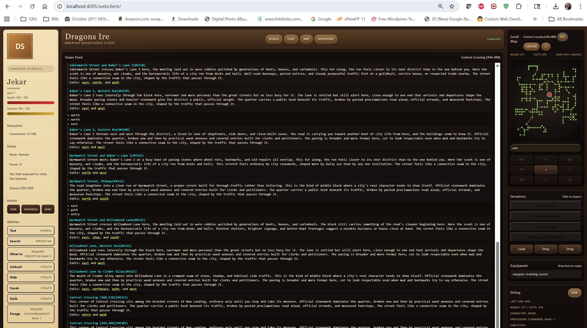

# Dragons Ire
[](images/DragonsIre.jpg)

# DireEngine

DireEngine is the game and engine workspace behind Dragons Ire: a browser-first, DragonRealms-inspired MUD built on Evennia with a custom client, custom world bootstrap, and a growing service-oriented gameplay core.

The project goal is not a museum clone. The goal is to keep the dangerous pacing, verb-driven depth, profession identity, injuries, and skill pressure that made classic text worlds compelling, then rebuild that experience with modern client support, stronger automation, and an architecture that can keep evolving.

## Overview

DireEngine is already far beyond a stock Evennia scaffold. The current codebase includes:

- a custom web client with structured character, subsystem, combat, and map updates
- a Godot client workspace with websocket support for an alternate native-style front end
- custom combat pacing with targeting, range, roundtime, weapon profiles, fatigue, balance, retaliation, and wound-aware damage handling
- a body-part injury system with severity, bleed pressure, tending, stabilization, scheduled bleed/recovery, and condition reporting
- death, corpse, grave, favor, depart, resurrection, and recovery loops instead of a trivial respawn model
- race, profession, subsystem, language, and progression foundations for a broader DragonRealms-style character model
- stealth, theft, justice, and reputation-facing systems including mark, shop heat, burglary/justice scenarios, contacts, and guard enforcement hooks
- inventory, equipment, containers, sheaths, improvised wielding, appraisal, vendors, buying, selling, haggle, banking, and carrying/encumbrance rules
- fieldcraft and survival verbs such as hide, stalk, sneak, search, forage, harvest, fish, track, skin, locksmithing, and trap interaction
- profession-facing systems for warrior, ranger, empath, thief, cleric, and shared profession/subsystem scaffolding for the wider guild roster
- AreaForge world tooling for graph/map-driven area generation, map payloads, and client navigation support
- DireTest scenario automation, baseline comparison, lag diagnostics, artifact capture, and replay tooling

## Current State

The project is in an active playable-alpha state.

What is implemented now:

- core movement, look, inventory, equipment, combat, death/recovery, and progression loops
- a custom onboarding/tutorial flow in The Landing
- law and enforcement behavior in lawful zones, including jail and pillory outcomes
- browser map interaction with fit/center controls, pathfinding, click-to-walk, and AreaForge zone payloads
- service/domain consolidation for combat, skills, state mutation, and wounds
- focused automated coverage for combat math, wounds, service contracts, onboarding, economy, movement, death loops, justice, and more through DireTest

What is still partial or under expansion:

- many professions have registry/profile support before they have full ability parity
- some guild mechanics are scaffolding-first and still need deeper content and balance passes
- the Godot client exists and is wired for websocket use, but the browser client remains the primary player-facing surface
- world content is growing faster than the long-form docs, which is why this README and the as-built snapshot are maintained separately

For the more detailed implementation snapshot, see [AS_BUILT.md](AS_BUILT.md).

## Feature Areas

### Core gameplay

- stateful combat with target selection, range management, attack resolution, resource pressure, and retaliation
- wound consequences layered on top of HP loss, including body-part trauma and bleed processing
- persistent death consequences with corpse handling, graves, favor, depart modes, and recovery workflows
- learning and mindstate-driven advancement instead of instant rank gains

### Profession and system identity

- warrior tempo, berserks, roars, and exhaustion recovery
- ranger bond, terrain support, trail and tracking systems, companion hooks, and fieldcraft support
- empath wound/healing systems, links, shock/strain support, and recovery-facing mechanics
- thief-facing systems including khri hooks, mark/theft support, burglary/justice scenarios, contacts, and stealth support
- cleric devotion and commune support plus death/favor/revival-facing mechanics
- shared registry support for the broader profession roster, including commoner, barbarian, bard, moon mage, necromancer, paladin, trader, warrior mage, and others

### Clients and maps

- custom browser UI under `web/` with structured payload updates
- zone and local map rendering, pathfinding, and click movement
- Godot client workspace under `godot/` with websocket integration on the portal side
- AreaForge-backed zone maps and fallback local-map behavior for non-authored spaces

### World and tooling

- auto-bootstrap of The Landing and supporting spaces on startup
- Brookhollow justice setup and guard, jail, and pillory support
- AreaForge content pipeline for turning processed map data into playable area graphs
- DireTest scenario runner with artifact bundles, replay support, lag reporting, and baseline save/compare workflows

## Quickstart

This repository currently assumes a Python 3.11 environment with Evennia available. In this workspace that environment is `.venv`; there is no pinned dependency manifest checked in yet, so a fresh machine will need an Evennia-capable environment prepared first.

From the repo root on Windows PowerShell:

```powershell
& .\.venv\Scripts\Activate.ps1
evennia migrate
evennia start
```

Open the browser client at:

```text
http://localhost:4001/webclient/
```

Useful notes:

- the default Evennia web port is in use here because `server/conf/settings.py` does not override it
- the Godot websocket bridge is enabled and listens on `127.0.0.1:4008`
- the server start hooks bootstrap world state through `server/conf/at_server_startstop.py`

To stop the server:

```powershell
evennia stop
```

## Testing And Diagnostics

DireTest is the main regression and scenario harness.

Common entry points:

```powershell
c:/Users/gary/dragonsire/.venv/Scripts/python.exe diretest.py list
c:/Users/gary/dragonsire/.venv/Scripts/python.exe diretest.py scenario movement --seed 1234
c:/Users/gary/dragonsire/.venv/Scripts/python.exe diretest.py scenario combat-basic --seed 1234
c:/Users/gary/dragonsire/.venv/Scripts/python.exe diretest.py scenario death-loop --seed 1234
c:/Users/gary/dragonsire/.venv/Scripts/python.exe diretest.py scenario justice-guardhouse-flow --seed 1234
c:/Users/gary/dragonsire/.venv/Scripts/python.exe diretest.py baseline save v1 --seed 1234
c:/Users/gary/dragonsire/.venv/Scripts/python.exe diretest.py baseline compare v1 --seed 1234
```

The repo also includes focused tooling such as:

- `tools/architecture_audit.py`
- `tools/full_death_to_res_suite.py`
- `tools/empath_guild_maintenance.py`

## Project Layout

- `commands/`: player verbs, admin tools, and command-entry behavior
- `typeclasses/`: persistent object behavior and legacy integration surface
- `engine/`: service-layer orchestration and typed engine contracts
- `domain/`: pure combat and wound rules
- `world/`: professions, systems, race/language support, AreaForge, and world bootstrap code
- `web/`: custom browser client templates and static assets
- `godot/`: Godot client workspace and related experiments/integration
- `tests/`: focused domain/service tests and other validation coverage
- `artifacts/`: saved DireTest outputs and baseline/scenario artifacts
- `docs/architecture/`: current architecture and timing rules

## Architecture Direction

The current direction is a clearer separation of responsibilities:

- commands delegate to services instead of owning core mutation rules
- `engine/services/` owns orchestration and game-state authority
- `domain/` owns pure rule calculations such as combat math and wound logic
- `typeclasses/characters.py` remains the compatibility surface, persistence bridge, and live Evennia object API
- scheduler and ticker responsibilities are being tightened so periodic work stays scoped and measurable

## License

DireEngine is licensed under the BSD 3-Clause License in [LICENSE.txt](LICENSE.txt).

This repository also includes Evennia-derived and Evennia-dependent work. Evennia's license is included separately in [LICENSE.evennia.txt](LICENSE.evennia.txt).
