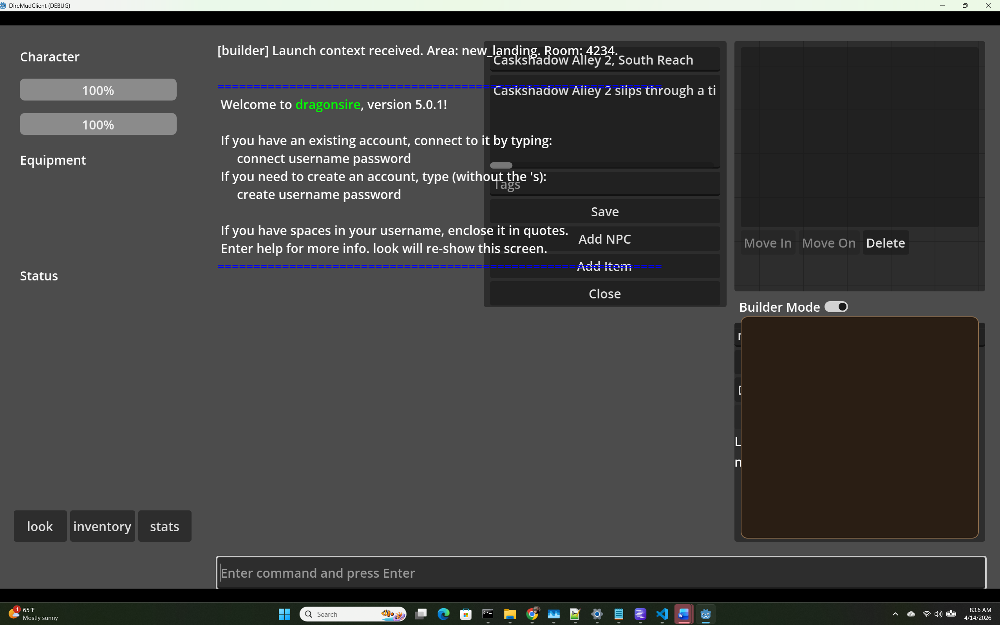

# DireBuilder As Built

This file is the lightweight implementation log for DireBuilder planning and build work.

Use it to answer:

- what Builder decisions have already been locked
- which files changed for each substantive Builder step
- how another developer can reasonably reproduce or continue the work
- what remains intentionally undecided

## Update Rule

Append a short entry for each substantive Builder step.

Do not log tiny wording tweaks or typo-only edits. Log real changes in architecture, contracts, isolation rules, API shape, persistence shape, or implementation slices.

Use this timestamp format:

`2026-04-13 hh:mm:ss`

## Entry Template

2026-04-13 hh:mm:ss
## TASK DB-XXX [Short Name]
### What changed
### Files touched
### Reproduction notes

2026-04-13 15:46:38
## TASK DB-000 Create Builder As-Built Log
### What changed
Created this file as the running implementation log for DireBuilder so future work can be reproduced without rereading the full blueprint or chat history.

### Files touched
- `direBuilderAsBuilt.md`
- `DireBuilder.md`

### Reproduction notes
Start from `DireBuilder.md` for the target architecture and append one short entry here whenever Builder work materially changes the plan or implementation. Keep entries concise and implementation-focused.

### What the next dev should know
This file is intended to be lighter than the blueprint. It should explain what changed, where it changed, and what assumptions are now locked.

### Known limits
This is a process artifact, not a full design document. It does not replace `DireBuilder.md`.

2026-04-13 15:46:39
## TASK DB-001 Lock Canonical Live World Schema
### What changed
Formalized Phase 0 as the authoritative live world contract in `DireBuilder.md`. The schema now explicitly defines rooms, exits, objects, templates, instances, placement, vendor behavior, coordinates, and map import expectations against Evennia's live world model.

### Files touched
- `DireBuilder.md`

### Reproduction notes
Read Section `0. Canonical Live World Schema` first. Any future Builder backend or import/export work should map back to that contract instead of inventing a parallel room graph or object hierarchy.

### What the next dev should know
The key lock is that movement remains exit-based, placement remains Evennia-location-based, and Builder/AreaForge/admin tools must all converge on the same live world structure.

### Known limits
Stable room identifiers, full template persistence, and multi-floor coordinate policy are still open decisions.

2026-04-13 15:46:40
## TASK DB-002 Separate AreaForge From Builder Mode
### What changed
Rewrote the builder blueprint to explicitly separate AreaForge from Builder Mode. AreaForge is now documented as an import and reconstruction pipeline, while Builder Mode is documented as the forward-authoring system for native world creation and editing.

### Files touched
- `DireBuilder.md`

### Reproduction notes
Review Sections `14.13`, `14.14`, and `14.15` in `DireBuilder.md`. When designing Builder features, reuse only the compatible live-world output shape and map payload expectations from AreaForge, not OCR or parser assumptions.

### What the next dev should know
Builder Mode must not be built on top of AreaForge internals. The shared target is the Evennia world model, not the same pipeline.

### Known limits
Bridge work between Builder-authored data and AreaForge artifacts is still optional future work, not foundation work.

2026-04-13 15:46:41
## TASK DB-003 Add Repo-Specific Builder Reconnaissance
### What changed
Appended a repo-grounded reconnaissance section to the builder blueprint describing the current code reality: browser and Godot transport surfaces, existing Django JSON API patterns, live world mutation paths, room and exit schema reuse, AreaForge map payload shape, template-system gaps, and the safest implementation order for this repo.

### Files touched
- `DireBuilder.md`

### Reproduction notes
Read Section `14. Codebase-Specific Reconnaissance (2026-04-13)` before writing any Builder code. It identifies the current owning surfaces in the repo and the gaps that still need real design instead of UI-first work.

### What the next dev should know
The biggest current gap is not client UX. It is the absence of a dedicated builder mutation/service layer and the lack of a unified template persistence model.

### Known limits
This reconnaissance is accurate to the repo state inspected on 2026-04-13. It should be refreshed if the underlying runtime architecture changes significantly.

2026-04-13 15:46:42
## TASK DB-004 Lock Builder Isolation And Optionality
### What changed
Added Phase `0.14 Builder Isolation and Optionality` to require that DireBuilder remain a private, optional, plugin-style extension that DireEngine can run without. The blueprint now explicitly requires isolated directory structure, guarded imports, feature gating, conditional API loading, and a removal test where the engine still boots without Builder.

### Files touched
- `DireBuilder.md`

### Reproduction notes
Read Section `0.14` before creating any Builder package or endpoint. If a change would make core engine runtime depend on `world/builder/`, it violates the current architecture lock.

### What the next dev should know
The hard rule is: DireEngine must never know DireBuilder exists. Dependency direction is one-way only. Builder may call into the engine; the engine may not require Builder.

### Known limits
This step locks the architecture rule, not the implementation. The capability helper, conditional URL registration, and private package layout still need to be built when Builder implementation starts.

2026-04-13 15:46:43
## TASK DB-005 Build Foundation Slice For Schema, Room Service, And Map Import
### What changed
Built the first private Builder implementation slice under `world/builder/`: a locked `map_schema_v1` validator, a minimal room mutation service, and a two-pass map importer that creates rooms before exits. Added a `world/builder/` ignore rule so the private Builder tree stays out of normal git flows unless intentionally included later.

### Files touched
- `.gitignore`
- `world/builder/__init__.py`
- `world/builder/schemas/__init__.py`
- `world/builder/schemas/map_schema_v1.py`
- `world/builder/services/__init__.py`
- `world/builder/services/room_service.py`
- `world/builder/services/map_importer.py`
- `direBuilderAsBuilt.md`

### Reproduction notes
From a repo checkout with the Evennia environment available, create the private `world/builder/` package locally, keep it ignored in `.gitignore`, then import `validate_map_schema(...)`, `create_room(...)`, and `import_map(...)` from the new modules. The importer contract is schema-first, pass-1 room creation, pass-2 exit creation.

### What the next dev should know
This slice proves the foundation only. It intentionally does not include templates, placement hierarchy, AI generation, vendor logic, or UI hooks. Stable builder IDs are stored on `room.db.builder_id`, and rooms are also tagged for lookup by Builder services.

### Known limits
Because `world/builder/` is now ignored, these files stay local unless the ignore rule is changed or files are force-added intentionally. The importer is minimal and idempotent for rooms and same-key exits, but it does not yet handle reverse-exit policy, deletion sync, or richer metadata.

2026-04-13 16:54:00
## TASK DB-006 Lock Exit Identity And Reconciliation
### What changed
Added a dedicated Builder `exit_service` and moved importer exit reconciliation into it. Exit identity is now explicitly locked to `(source room, direction)`, with deterministic behavior for create, no-op, and destination-change replacement.

### Files touched
- `world/builder/services/exit_service.py`
- `world/builder/services/map_importer.py`
- `world/builder/services/__init__.py`
- `direBuilderAsBuilt.md`

### Reproduction notes
Within a configured Evennia runtime, call `ensure_exit(source, direction, target)` to reconcile a single directional edge. The importer now delegates all exit handling through that service, so repeated imports with the same graph are idempotent and re-targeted exits are replaced rather than silently drifting.

### What the next dev should know
This intentionally does not auto-create reverse exits and does not delete exits that disappear from schema input. The deterministic invariant is only one exit per direction per source room, pointing at the requested target.

### Known limits
Schema removal of a direction still leaves an existing exit in place. Reverse-exit symmetry, deletion sync, aliases, and richer exit metadata remain future work.

2026-04-13 17:08:00
## TASK DB-007 Add Template Registry And Spawn Foundation
### What changed
Added a pure-Python template schema and registry layer plus a guarded spawn service for item and NPC templates. Builder can now validate and persist a local template registry, look up templates by id or search terms, and spawn live Evennia objects with `db.template_id` and `db.builder_spawned` persisted.

### Files touched
- `world/builder/schemas/template_schema_v1.py`
- `world/builder/schemas/__init__.py`
- `world/builder/services/template_service.py`
- `world/builder/services/spawn_service.py`
- `world/builder/services/__init__.py`
- `world/builder/templates/template_registry_v1.json`
- `direBuilderAsBuilt.md`

### Reproduction notes
Use `load_template_registry()` and `register_template(...)` to manage the local Builder registry stored under `world/builder/templates/`. Within a configured Evennia runtime, call `spawn_from_template(template_id, location)` or `spawn_from_template_result(...)` to create room-placed item or NPC instances.

### What the next dev should know
This slice intentionally keeps NPC spawning on the generic `Object` typeclass for now. The stable contract is local registry validity, deterministic lookup, and persisted provenance on spawned instances, not behavior-rich NPC spawning.

### Known limits
There are still no API endpoints, no placement-on-surface/container logic, no vendor or role profiles, and no deletion semantics for templates. Registry storage is local JSON and meant as the minimal bridge to later API-backed tooling.

2026-04-13 17:24:00
## TASK DB-008 Add Capability Gate And Thin Builder API
### What changed
Added a centralized Builder capability module plus a thin `web/api/builder` package that delegates template and spawn operations straight to Builder services. The main API router now conditionally includes Builder routes only when the Builder plugin and its required services are ready.

### Files touched
- `world/builder/capabilities.py`
- `web/api/builder/__init__.py`
- `web/api/builder/views.py`
- `web/api/builder/urls.py`
- `web/api/urls.py`
- `direBuilderAsBuilt.md`

### Reproduction notes
With Builder present and runtime services available, the API now exposes `/api/builder/templates/`, `/api/builder/templates/search/`, `/api/builder/templates/<template_id>/`, `/api/builder/templates/create/`, `/api/builder/templates/<template_id>/update/`, and `/api/builder/spawn/`. If Builder is absent, those routes are not included and the rest of the web API still loads normally.

### What the next dev should know
The Builder API intentionally contains no direct world mutation logic. It parses requests, resolves the location for spawn calls, and delegates everything else to `template_service` and `spawn_service`.

### Known limits
This slice does not add auth/permission policy, instance management endpoints, placement endpoints, or expanded audit logging. The capability helper is intentionally simple and not cached.

2026-04-13 17:49:00
## TASK DB-010 Add Placement And Instance Lifecycle Foundation
### What changed
Added Builder placement and instance services for minimal move and delete lifecycle operations, then exposed them through thin Builder API endpoints. The new placement layer supports room and container moves with circular containment protection, while the instance layer supports object lookup and safe deletion with room deletion blocked.

### Files touched
- `world/builder/services/placement_service.py`
- `world/builder/services/instance_service.py`
- `world/builder/services/__init__.py`
- `world/builder/capabilities.py`
- `web/api/builder/views.py`
- `web/api/builder/urls.py`
- `direBuilderAsBuilt.md`

### Reproduction notes
Within a configured Evennia runtime, call `move_to_location(obj, destination)` or `delete_instance_by_id(object_id)` from the new Builder services. The Builder API now also exposes `/api/builder/move/` and `/api/builder/delete/` as thin delegating wrappers over those services.

2026-04-16 12:00:00
## TASK DB-361-390 Add Zones, Cross-Zone Exit Editing, And DB Library Selectors
### What changed
Added a persisted Builder zone registry plus zone list/create API endpoints, then switched the Godot Builder flow from freeform area entry to zone selection and zone creation. Map export and local preview state now carry zone-aware exit targets as `{ zone_id, room_id }`, the room inspector now uses button-based exit direction controls instead of a direction dropdown, and item/NPC placement now goes through explicit library selectors backed by dedicated API endpoints rather than the older generic template search flow.

### Files touched
- `world/builder/schemas/zone_schema_v1.py`
- `world/builder/services/zone_service.py`
- `world/builder/services/room_service.py`
- `world/builder/services/map_exporter.py`
- `world/builder/services/map_diff_service.py`
- `world/builder/services/undo_service.py`
- `world/builder/services/__init__.py`
- `world/builder/schemas/map_schema_v1.py`
- `web/api/builder/views.py`
- `web/api/builder/urls.py`
- `godot/DireMudClient/scripts/builder_api.gd`
- `godot/DireMudClient/scenes/Main.tscn`
- `godot/DireMudClient/scenes/builder/MapGrid.gd`
- `godot/DireMudClient/scenes/builder/RoomEditor.gd`
- `godot/DireMudClient/scenes/builder/RoomEditor.tscn`
- `godot/DireMudClient/scenes/builder/TemplateSelector.gd`
- `godot/DireMudClient/scenes/builder/TemplateSelector.tscn`
- `godot/DireMudClient/scenes/builder/BuilderController.gd`
- `direBuilderAsBuilt.md`

### Reproduction notes
Start the Builder, use the new zone dropdown on the left panel to load an existing zone or create a new one, and confirm the map view resets on zone switch. Select a room, edit an existing exit from the inspector, and verify the editor now offers zone-first target selection plus button-driven direction changes; same-zone exits still render on the grid while cross-zone targets remain available from the inspector. Use `Add NPC` or `Add Object` in the room inspector and confirm the selector opens a dedicated library list, with item placement allowing room or selected-NPC destination when an NPC is selected in the content tree.

### What the next dev should know
The Builder still uses `current_area_id` internally as the active zone identifier to limit churn, but the API and exported payloads are now zone-aware. Reverse exits are still auto-created only for same-zone edits because cross-zone reverse creation needs an explicit world-design policy rather than an implicit guess.

### Known limits
This slice does not yet add a dedicated cross-zone map browser or visual overlay for exits leaving the currently loaded zone, and newly created zone ids still depend on the operator entering a stable slug. The local room cache remains per-loaded-zone, so cross-zone target validation in the client depends on the zone registry room summaries rather than a fully loaded target zone map.

2026-04-16 16:05:00
## TASK DB-432 Tighten Builder NPC Selection And Exit Editing Surfacing
### What changed
Adjusted Builder map interaction so object hit testing now prefers NPCs over room clicks, gives NPC markers a larger explicit click target, and shows NPC hover context in the shared tooltip. Also changed the room inspector to auto-select the first exit when a room opens so the existing exit-edit controls surface immediately instead of looking read-only until the operator manually picks a row.

### Files touched
- `godot/DireMudClient/scenes/builder/MapGrid.gd`
- `godot/DireMudClient/scenes/builder/ObjectNode.gd`
- `godot/DireMudClient/scenes/builder/RoomEditor.gd`
- `direBuilderAsBuilt.md`

### Reproduction notes
Launch Builder into `new_landing`, hover an NPC marker to confirm the tooltip shows NPC identity instead of only room data, then click a guard or other NPC and verify the inspector switches to object context more reliably. Select a room with exits and confirm the exit editor opens populated by default without requiring a second selection step in the exit list.

### What the next dev should know
This slice improves selection and inspector surfacing without changing the underlying builder diff contract or room/object ownership model. If NPC selection still misses in edge overlaps, the next likely refinement is distance-weighted picking against rendered sprite bounds rather than only enlarged rectangular hit areas.

### Known limits
This does not yet address zone creation feedback polish, cross-zone browsing UX, or broader map-label readability controls. The legacy web export endpoint on port `4001` still rejects legacy area ids like `new_landing`, so launcher fallback remains part of the current builder path.

### What the next dev should know
This slice still treats placement as raw Evennia location moves only. There is no surface placement, no container rule system beyond circular containment prevention, and no persistence-backed audit log yet.

### Known limits
Auth and permission checks are still absent. Placement semantics are limited to room/container movement, and delete protection only blocks room deletion, not broader policy-driven protected objects.

2026-04-13 17:31:00
## TASK DB-009 Lock Evennia Search Import Convention
### What changed
Locked a Builder blueprint rule requiring explicit Evennia object lookup imports from `evennia.utils.search` instead of relying on top-level Evennia re-exports. This codifies the import pattern already needed by the thin Builder API spawn flow.

### Files touched
- `DireBuilder.md`
- `direBuilderAsBuilt.md`

### Reproduction notes
When Builder code needs `search_object`, import it with `from evennia.utils.search import search_object`. Do not use `from evennia import search_object` in Builder services or Builder API code.

### What the next dev should know
This is a consistency and runtime-safety rule, not a style preference. It exists because mixed Evennia import surfaces can behave differently across code paths and runtime contexts.

### Known limits
This locks the Builder-side convention only. It does not retroactively normalize older non-Builder modules elsewhere in the repo.

2026-04-13 17:56:00
## TASK DB-011 Lock Explicit Capability Service Probing
### What changed
Replaced the hand-written Builder service availability boolean chain with an explicit `REQUIRED_SERVICES` list plus import probing. This makes the Builder capability gate less error-prone as additional services are added.

### Files touched
- `world/builder/capabilities.py`
- `DireBuilder.md`
- `direBuilderAsBuilt.md`

### Reproduction notes
When expanding Builder readiness checks, add the new service module name to `REQUIRED_SERVICES` and let `builder_services_available()` probe imports from `world.builder.services.<service_name>`. Do not extend the gate with long chained boolean expressions.

### What the next dev should know
This is a defensive maintenance rule. It prevents silent typos, malformed boolean expressions, and stale partial checks as the Builder service surface grows.

### Known limits
This only hardens service probing. It does not validate service contracts, runtime permissions, or partial capability mismatches inside otherwise importable modules.

2026-04-16 14:40:00
## TASK DB-391-430 Add Hybrid Instance Inspector And Template Workspace Foundation
### What changed
Fixed a Builder inspector regression where room selection could blank the right panel because `RoomEditor.gd` still referenced the removed `exit_direction_select` control during exit-list rebuilds.

Built the first hybrid NPC/item authoring slice on top of the existing map-first Builder flow. Live object editing now has a dedicated instance inspector surface, while NPC and item templates each have their own separate workspace panel instead of forcing instance edits into full-screen tabs. The backend Builder diff/export/template pipeline was extended to support richer template payloads, richer exported object payloads, and a real `update_object` diff operation for staged instance edits.

On the Godot side, the right panel now has explicit workspace tabs for `Inspector`, `NPC Templates`, and `Item Templates`. Room selection still opens the room inspector, object selection now opens the instance inspector, and template editing routes to the dedicated workspace panels.

### Files touched
- `world/builder/schemas/template_schema_v1.py`
- `world/builder/services/template_service.py`
- `world/builder/services/spawn_service.py`
- `world/builder/services/instance_service.py`
- `world/builder/services/map_exporter.py`
- `world/builder/services/map_diff_service.py`
- `world/builder/services/__init__.py`
- `godot/DireMudClient/scripts/builder_api.gd`
- `godot/DireMudClient/scenes/Main.tscn`
- `godot/DireMudClient/scenes/builder/RoomEditor.gd`
- `godot/DireMudClient/scenes/builder/BuilderController.gd`
- `godot/DireMudClient/scenes/builder/InstanceEditor.gd`
- `godot/DireMudClient/scenes/builder/InstanceEditor.tscn`
- `godot/DireMudClient/scenes/builder/TemplateWorkspace.gd`
- `godot/DireMudClient/scenes/builder/TemplateWorkspace.tscn`
- `direBuilderAsBuilt.md`

### Reproduction notes
Open Builder Mode, select a room, and confirm the right panel populates normally again. Select an NPC or item from the map or content tree and verify the new instance inspector appears instead of the room editor. Use the workspace tabs to switch into `NPC Templates` or `Item Templates`, edit a template, and return to `Inspector` without losing the map-first editing context.

### What the next dev should know
The important architecture lock is the workflow split: instances are edited as staged world diffs from the inspector, while templates are edited in dedicated workspaces. Do not collapse those back into a single generic panel or bypass the diff/export pipeline for live object edits.

### Known limits
This slice establishes the UI and service foundations only. It does not yet add richer inventory relationship editing, behavior-specific NPC authoring, or deeper template schema beyond the current attribute/flag/item metadata fields.

2026-04-15 21:20:16
## TASK DB-012 Add Interactive Exit Editor Slice
### What changed
Replaced the room inspector's passive exit count with an interactive exits section. Builder users can now select an existing exit in the room inspector, retarget it to another room id, or delete it directly from the inspector instead of only drawing or deleting exits from the map canvas.

The controller-side staging logic now also cleans up stale reverse exits when an existing exit is rerouted, so changing `north -> old_room` to `north -> new_room` no longer leaves the old room's reverse link behind.

### Files touched
- `godot/DireMudClient/scenes/builder/RoomEditor.tscn`
- `godot/DireMudClient/scenes/builder/RoomEditor.gd`
- `godot/DireMudClient/scenes/builder/BuilderController.gd`
- `direBuilderAsBuilt.md`

### Reproduction notes
Open Builder Mode, select a room, then use the new `Exits` section in the right-hand room inspector. Click an exit row, change the target room id, and press `Save Exit` to stage a reroute. Press `Delete Exit` to stage removal of that directional exit and its reverse link when applicable.

### What the next dev should know
This is the first editor-system slice, not the full attribute system. Exits are still persisted through the existing directional `set_exit` and `delete_exit` operations, so direction remains the system key and target room id remains the only editable exit payload currently staged from the inspector.

### Known limits
Exit labels, aliases, and richer metadata are not yet persisted. The inspector validates against room ids present in the current loaded map only, and exit creation still primarily happens through map-canvas draw-exit mode rather than a dedicated create-exit form.

### Known limits
This probes module importability, not deeper runtime health. Service-specific runtime availability flags still matter inside the imported modules themselves.

2026-04-13 18:12:00
## TASK DB-012 Add Placement Semantics, Audit Log, And Map Import API
### What changed
Extended Builder placement to persist `db.placement_type` and enforce a maximum nesting depth, added a persistent append-only Builder audit log with atomic writes, and exposed map import through the thin Builder API with a stubbed `safe|strict` mode parameter.

### Files touched
- `world/builder/services/placement_service.py`
- `world/builder/services/instance_service.py`
- `world/builder/services/spawn_service.py`
- `world/builder/services/audit_service.py`
- `world/builder/services/map_importer.py`
- `world/builder/services/__init__.py`
- `world/builder/capabilities.py`
- `world/builder/audit/audit_log_v1.json`
- `web/api/builder/views.py`
- `web/api/builder/urls.py`
- `direBuilderAsBuilt.md`

### Reproduction notes
Within a configured Evennia runtime, use `move_to_location(...)`, `move_instance(...)`, or `delete_instance_by_id(...)` for lifecycle operations and inspect `world/builder/audit/audit_log_v1.json` for the resulting structured audit entries. The Builder API now also exposes `/api/builder/map/import/` and accepts `{"map": {...}, "mode": "safe"|"strict"}`.

### What the next dev should know
Placement semantics are still intentionally minimal: only `room` versus `container` is persisted, and `strict` map import mode is only a placeholder hook for future exact-topology enforcement. Audit storage is local JSON and intentionally lightweight.

### Known limits
Surface placement is still absent, audit querying/rotation is not implemented, and strict import mode does not yet remove missing exits or enforce exact topology. SQLite cleanup during ad hoc runtime probes can still hit transient `database is locked` conditions.

2026-04-13 18:20:00
## TASK DB-013 Add Audit Soft Size Warning
### What changed
Clarified the Builder audit log size guard as a soft limit instead of a generic byte threshold. The audit service now warns with both the current file size and configured soft limit in MB when the local JSON audit log grows large.

### Files touched
- `world/builder/services/audit_service.py`
- `direBuilderAsBuilt.md`

### Reproduction notes
Increase `world/builder/audit/audit_log_v1.json` beyond the configured soft limit and call `log_audit_event(...)`. The service should emit a warning but continue writing inline without rotation.

### What the next dev should know
This is intentionally only a detection guard. Audit writes remain synchronous and inline with mutations for now.

### Known limits
No rotation, truncation, buffering, or async audit pipeline exists yet. Large logs will still be fully rewritten on each event until a later storage change lands.

2026-04-13 18:42:00
## TASK DB-014 Add Surface Placement, Audit Querying, Map Export, And Edit APIs
### What changed
Extended Builder placement to distinguish room, container, and surface destinations with explicit `in` versus `on` relations, added audit read/query helpers plus an audit API endpoint, added a schema-compliant world-to-JSON map exporter, and exposed initial room and exit edit endpoints through the thin Builder API.

### Files touched
- `world/builder/services/placement_service.py`
- `world/builder/services/audit_service.py`
- `world/builder/services/room_service.py`
- `world/builder/services/exit_service.py`
- `world/builder/services/map_importer.py`
- `world/builder/services/map_exporter.py`
- `world/builder/services/__init__.py`
- `world/builder/capabilities.py`
- `web/api/builder/views.py`
- `web/api/builder/urls.py`
- `direBuilderAsBuilt.md`

### Reproduction notes
Use `move_with_relation(obj, destination, relation="in"|"on")` for explicit placement semantics, query `/api/builder/audit/` with `object_id`, `action`, `start_ts`, `end_ts`, and `limit`, call `/api/builder/map/export/<area_id>/` to round-trip Builder-managed rooms back into schema-compliant JSON, and use `/api/builder/room/update/<room_id>/`, `/api/builder/exit/create/`, and `/api/builder/exit/delete/` for thin edit flows.

### What the next dev should know
Surface placement is still declarative only: destinations can mark `db.is_surface = True`, and the Builder layer now records `placement_type` and `placement_relation`, but it still does not enforce richer stacking or physics rules. Map export depends on Builder-managed rooms having both `db.builder_id` and `db.region`, so the importer now stamps imported rooms with the root `area_id` as their region.

### Known limits
Audit queries are in-memory filters over the local JSON log, room update endpoints remain intentionally narrow, exit edits do not yet emit dedicated audit events, and export currently includes only Builder-managed rooms with stable builder ids.

2026-04-13 18:49:00
## TASK DB-015 Lock Explicit Room Area Id For Export
### What changed
Made `area_id` an explicit persisted field on Builder-managed rooms, updated the importer to stamp it during map import, and changed map export to filter rooms by `room.db.area_id` instead of relying on the older region field. Also clarified in the audit service that query results are always sorted newest first before any limit is applied.

### Files touched
- `world/builder/services/room_service.py`
- `world/builder/services/map_importer.py`
- `world/builder/services/map_exporter.py`
- `world/builder/services/audit_service.py`
- `direBuilderAsBuilt.md`

### Reproduction notes
Import a Builder map, confirm imported rooms now carry `db.area_id`, and export the same area through `/api/builder/map/export/<area_id>/`. Audit queries through `load_audit_log()` or `/api/builder/audit/` should continue returning newest-first entries before `limit` truncation.

### What the next dev should know
`db.area_id` is now the explicit contract for Builder map ownership. `db.region` can still exist for broader world systems, but Builder export should not rely on it for area membership.

### Known limits
Map export still scans room objects globally before filtering by `db.area_id`; it is now logically safer but not yet index-driven. Audit timestamps remain simple numeric wall-clock values, not monotonic ids.

2026-04-13 18:58:00
## TASK DB-016 Lock Deterministic Map Diff Model
### What changed
Extended the Builder blueprint with a deterministic diff contract for future map editing. The design locks the first diff shape, allowed operations, dispatcher model, orchestration boundaries, failure behavior, audit integration, room-delete safety rule, and the thin `/api/builder/map/diff/` endpoint contract before any implementation starts.

### Files touched
- `DireBuilder.md`
- `direBuilderAsBuilt.md`

### Reproduction notes
Read the `3.9.1` through `3.9.8` sections in `DireBuilder.md` for the canonical diff model. The intended first implementation is `world/builder/services/map_diff_service.py` with explicit ordered operations only: `create_room`, `update_room`, `delete_room`, `set_exit`, and `delete_exit`.

### What the next dev should know
This locks diff as explicit deterministic mutation, not inferred reconciliation. The diff service should orchestrate existing room and exit services and stop immediately on first failure.

### Known limits
This is design-only. No diff service, diff validator, or diff API endpoint exists yet, and room deletion is explicitly specified to fail when incoming exits still reference the room.

2026-04-13 19:04:00
## TASK DB-017 Add Optional Diff Operation Id Contract
### What changed
Extended the design-only diff contract so each diff operation may include an optional string `id`. The blueprint now explicitly preserves that id for traceability and audit linking while keeping execution semantics based only on operation list order.

### Files touched
- `DireBuilder.md`
- `direBuilderAsBuilt.md`

### Reproduction notes
Read the deterministic diff section in `DireBuilder.md`. Diff operations may now include an optional `id` like `op-001`, and future audit events for `diff_apply` should carry `operation_id` through when present.

### What the next dev should know
This is a cheap forward-compatibility hook for traceability, undo support, and audit correlation. It should be accepted but remain semantically inert in the first implementation.

### Known limits
This is still design-only. No diff parser or service implementation exists yet, and no uniqueness or cross-diff id policy is defined beyond non-empty string validation.

2026-04-13 19:08:00
## TASK DB-018 Add Diff Operation Id Normalization Rule
### What changed
Extended the design-only diff contract with an internal normalization rule for operation ids. If a diff operation omits `id`, the implementation should derive `operation_id = op.get("id") or f"auto-{index}"`, where `index` is the operation position in the list.

### Files touched
- `DireBuilder.md`
- `direBuilderAsBuilt.md`

### Reproduction notes
Read the deterministic diff section in `DireBuilder.md`. The implementation should preserve caller-supplied ids when present and otherwise generate fallback ids like `auto-0`, `auto-1`, and `auto-2` for audit and traceability.

### What the next dev should know
This keeps ids optional for callers while guaranteeing that every diff operation still has an audit-visible trace id during application.

### Known limits
This is still design-only. The fallback id is stable only within a given diff payload order and is not a global identity scheme.

2026-04-13 19:18:00
## TASK DB-019 Build Deterministic Map Diff Service And API
### What changed
Implemented the first deterministic Builder diff engine as an ordered, fail-fast orchestrator over existing room, exit, and instance services. Added minimal strict diff validation, per-operation dispatch, `operation_id` audit integration, room-delete safety for incoming exits, and the thin `/api/builder/map/diff/` endpoint.

### Files touched
- `world/builder/services/map_diff_service.py`
- `world/builder/services/instance_service.py`
- `world/builder/services/__init__.py`
- `world/builder/capabilities.py`
- `web/api/builder/views.py`
- `web/api/builder/urls.py`
- `direBuilderAsBuilt.md`

### Reproduction notes
POST `{"diff": {...}}` to `/api/builder/map/diff/` using the locked diff shape from `DireBuilder.md`. Supported operations are `create_room`, `update_room`, `delete_room`, `set_exit`, and `delete_exit`. The service applies them in order, stops on first failure, and records `diff_apply` audit events with `operation_id`.

### What the next dev should know
This implementation deliberately does no inference and no batching. Room deletion is only allowed through the diff service path after an explicit incoming-exit safety check, using the instance service with `allow_room=True` so the public object-delete API behavior remains unchanged.

### Known limits
Failure handling is fail-fast but not transactional; operations already applied before a failure remain applied. Diff validation is intentionally structural and minimal, and delete-room uses global exit lookup for incoming references.

2026-04-13 19:27:00
## TASK DB-020 Add Structured Diff Failure Metadata
### What changed
Extended diff failure handling so operation failures now carry structured metadata instead of only a string error. The diff service raises a dedicated `DiffApplyError` with `failed_operation_index` and normalized `failed_operation_id`, and the Builder diff API now exposes those fields in its 400 responses.

### Files touched
- `world/builder/services/map_diff_service.py`
- `world/builder/services/__init__.py`
- `web/api/builder/views.py`
- `direBuilderAsBuilt.md`

### Reproduction notes
Submit a diff to `/api/builder/map/diff/` where one later operation is invalid. The API response should include `ok: false`, the string `error`, `failed_operation_index`, and `failed_operation_id`. If the failing operation omitted `id`, the response should use the normalized fallback id like `auto-1`.

### What the next dev should know
This improves debugability and future tool integration without changing execution behavior. Explicit operation ids still matter for long-term undo or replay stability, but the fallback id is always available for immediate traceability.

### Known limits
The fallback `auto-{index}` id is stable only for a given diff ordering. If callers reorder operations and resubmit, fallback ids will shift accordingly.

2026-04-13 19:34:00
## TASK DB-021 Add Failed Operation Payload And Explicit Id Rule
### What changed
Extended diff failure responses to include the original failing operation payload as `failed_operation`, and tightened the blueprint contract so explicit operation ids are required for any persistent, replayable, collaborative, or undo-capable diff. Fallback ids remain allowed only for testing, ad-hoc usage, and immediate runtime traceability.

### Files touched
- `world/builder/services/map_diff_service.py`
- `web/api/builder/views.py`
- `DireBuilder.md`
- `direBuilderAsBuilt.md`

### Reproduction notes
Submit an invalid diff to `/api/builder/map/diff/`. The 400 response should now include `failed_operation_index`, `failed_operation_id`, and the original `failed_operation` mapping. Review the deterministic diff section in `DireBuilder.md` for the explicit-id rule on replayable or persistent diffs.

### What the next dev should know
This gives immediate debugging context to API clients and UI surfaces without requiring client-side reconstruction. The explicit-id rule now formally separates ephemeral trace ids from ids that are safe to depend on for undo or saved diff workflows.

### Known limits
Fallback ids still exist and still shift when operation ordering changes. The new `failed_operation` payload reflects the submitted operation as received, not a normalized or validated canonical form.

2026-04-13 19:48:00
## TASK DB-022 Add Diff Preview, Conflict Detection, And Undo Foundation
### What changed
Extended the deterministic diff engine with dry-run preview mode, preflight same-diff conflict detection, and the first undo foundation for supported operations. Preview validates diffs in order without mutating world state or writing audit events. Conflict detection now rejects duplicate room creates, conflicting exit assignments, update-after-delete contradictions, and create-delete contradictions before any execution occurs. Successful live applies now report `undo_available`, and when all operations are invertible they return an `undo_diff` built from captured pre-state for `update_room`, `set_exit`, and `delete_exit`.

### Files touched
- `world/builder/services/map_diff_service.py`
- `world/builder/services/undo_service.py`
- `world/builder/services/__init__.py`
- `world/builder/capabilities.py`
- `web/api/builder/views.py`
- `direBuilderAsBuilt.md`

### Reproduction notes
POST to `/api/builder/map/diff/` with `{"diff": {...}, "preview": true}` to validate a diff without mutating state. For conflict detection, submit a diff with two `set_exit` operations for the same `(source_id, direction)` but different `target_id`s and confirm the response contains a `conflicts` array and no mutation occurs. For undo foundation, apply a diff consisting only of invertible operations such as `update_room`, `set_exit`, or `delete_exit` and inspect `undo_available` and `undo_diff` in the success payload.

### What the next dev should know
Preview and live apply now share the same preflight validation path, which means structural failures and same-diff conflicts are caught before any execution begins. Undo is intentionally partial: room create/delete are still treated as non-invertible in `v1`, so mixed diffs that include them return `undo_available: false` even when other operations are invertible.

### Known limits
Preview validates sequentially and checks basic world-state dependencies, but there is still no transactional rollback engine. Conflict detection is intentionally narrow and same-diff only. Undo history is returned in-memory per successful apply only and is not persisted or replay-tracked yet.

2026-04-13 19:56:00
## TASK DB-023 Add Preview Operation Ids And Lock Progressive Diff State Rule
### What changed
Extended diff preview results so they now include normalized `operation_ids` alongside `validated_operations`, and explicitly documented that diff validation, execution, and undo pre-state all operate against a progressive in-diff state rather than a single snapshot.

### Files touched
- `world/builder/services/map_diff_service.py`
- `DireBuilder.md`
- `direBuilderAsBuilt.md`

### Reproduction notes
POST to `/api/builder/map/diff/` with `{"diff": {...}, "preview": true}` and confirm the preview payload includes `operation_ids` in execution order, preserving explicit ids and filling gaps with fallback ids like `auto-0`. Review the deterministic diff execution model in `DireBuilder.md` for the explicit progressive-state and undo-capture rule.

### What the next dev should know
Preview output is now directly usable as a UI correlation surface. The diff engine is explicitly progressive: later operations see earlier mutations, and undo capture must reflect that same progression.

### Known limits
Preview still returns validation metadata only, not a richer per-operation status matrix or patch visualization. Fallback ids remain ephemeral trace ids, not durable identities for replayable history.

2026-04-13 20:18:00
## TASK DB-024 Add Diff History Persistence, Undo Execution, Redo, And History Query API
### What changed
Added a persisted diff history service with atomic JSON writes and soft-size warnings, integrated successful non-preview diff applies into that history log, added executable undo and redo helpers that reuse the deterministic diff engine, and exposed thin API endpoints for undo, redo, and diff history queries.

### Files touched
- `world/builder/services/diff_history_service.py`
- `world/builder/history/diff_history_v1.json`
- `world/builder/services/map_diff_service.py`
- `world/builder/services/undo_service.py`
- `world/builder/services/__init__.py`
- `world/builder/capabilities.py`
- `web/api/builder/views.py`
- `web/api/builder/urls.py`
- `direBuilderAsBuilt.md`

### Reproduction notes
Apply a non-preview diff through `/api/builder/map/diff/` and confirm a new entry is appended to `world/builder/history/diff_history_v1.json` with `timestamp`, `area_id`, `diff`, `result`, `undo_diff`, and `operation_ids`. POST `{"undo_diff": {...}}` to `/api/builder/map/undo/` to execute a previously returned inverse diff, POST `{"diff": {...}}` to `/api/builder/map/redo/` to reapply an original diff, and query `/api/builder/map/history/?area_id=<id>&limit=<n>` for newest-first history reads.

### What the next dev should know
History persistence now lives in the same deterministic apply path as live diffs, so preview runs never write history and undo/redo automatically reuse the same validation, conflict detection, audit-per-operation behavior, and history persistence rules as any other diff apply. The new undo and redo endpoints are thin wrappers, not alternate execution engines.

### Known limits
History is append-only and unbranched. There is still no transactional rollback, grouped transactions, collaborative merge logic, or persisted pointer-based redo stack. History writes happen after successful mutation and are not yet isolated from post-apply storage failures.

2026-04-13 20:31:00
## TASK DB-025 Add History Entry Id And Event Type Metadata
### What changed
Extended persisted diff history entries with a generated `entry_id` UUID and an explicit event `type` of `apply`, `undo`, or `redo`. History classification now comes from the same deterministic diff execution path, so normal apply, undo execution, and redo execution all persist through one writer with distinct event metadata.

### Files touched
- `world/builder/services/diff_history_service.py`
- `world/builder/services/map_diff_service.py`
- `world/builder/services/undo_service.py`
- `direBuilderAsBuilt.md`

### Reproduction notes
Apply a normal diff, execute an undo through `/api/builder/map/undo/`, and execute a redo through `/api/builder/map/redo/`. Inspect `world/builder/history/diff_history_v1.json` and confirm each appended entry now includes a generated `entry_id` plus a `type` of `apply`, `undo`, or `redo`.

### What the next dev should know
This is the first metadata layer that makes history entries intrinsically addressable and classifiable without inferring intent from payload shape. It is the right base for future history-pointer logic and simpler UI event rendering.

### Known limits
History still stores full `diff` and `undo_diff` payloads inline, so file growth and read/parse cost are now the first clear scaling pressure point. The existing soft-limit warning is only detection; there is still no compaction, indexing, or external storage.

2026-04-13 21:02:00
## TASK DB-026 Add API Permission Gate, Lightweight Sessions, And Metadata-Only Grouping
### What changed
Added a simple Builder permission helper and enforced it at the Builder API layer, keeping services permission-agnostic for internal script and CLI usage. Added a lightweight in-memory session service with optional `session_id` support on diff requests, and extended diff apply so optional `session_id`, `user`, and `group_id` metadata flow into history while `group_id` also flows into per-operation diff audit entries. Documented that `group_id` is metadata only and does not change execution semantics.

### Files touched
- `world/builder/permissions.py`
- `world/builder/services/session_service.py`
- `world/builder/services/map_diff_service.py`
- `world/builder/services/__init__.py`
- `world/builder/capabilities.py`
- `web/api/builder/views.py`
- `DireBuilder.md`
- `direBuilderAsBuilt.md`

### Reproduction notes
Issue a Builder API request as a non-builder user and confirm the endpoint returns `403` with `permission_denied`. Create a session through `session_service.create_session(user, area_id)`, submit a diff to `/api/builder/map/diff/` with that `session_id`, and confirm the resulting history entry includes `session_id` and `user`. Submit another diff with a top-level `group_id` and confirm the history entry includes `group_id` and each `diff_apply` audit entry for that diff includes the same `group_id`.

### What the next dev should know
The permission rule is now explicit: Builder API endpoints gate access, Builder services do not. Sessions are lightweight logical editing contexts only, not auth sessions. Grouping is flat metadata for UI coherence, such as treating one drag or one description edit as a single logical action, and it must never alter execution semantics.

### Known limits
Sessions are in-memory only and have no expiry, persistence, locking, or cross-process coordination. Group ids are caller-managed, not unique, and no nested or transactional grouping exists.

2026-04-13 21:36:00
## TASK DB-027 Add Godot Builder API Client, Controller, And Grid Editing UI Foundation
### What changed
Added the first Godot Builder client layer inside the existing `godot/DireMudClient` project instead of creating a parallel client tree. Introduced a `BuilderApi` HTTP client for diff, undo, history, and export calls; a `BuilderController` overlay that runs a preview-first edit loop and manages builder mode, undo/redo, and refresh; and a `MapGrid` overlay scene for grid-based room creation, selection, dragging, deletion, and exit draw/delete interactions. The main scene now routes character and live map payload context into the Builder overlay and shows a Builder Mode toggle only when the character payload marks the user as builder-capable.

### Files touched
- `godot/DireMudClient/scripts/builder_api.gd`
- `godot/DireMudClient/scenes/builder/BuilderController.gd`
- `godot/DireMudClient/scenes/builder/MapGrid.gd`
- `godot/DireMudClient/scenes/builder/MapGrid.tscn`
- `godot/DireMudClient/scripts/Main.gd`
- `godot/DireMudClient/scenes/Main.tscn`
- `direBuilderAsBuilt.md`

### Reproduction notes
Run the Godot client project, receive a character payload with `is_builder` or `builder_mode_available`, toggle Builder Mode on, load an area through the Builder tools panel, and interact directly with the Builder grid. Empty-cell click emits preview-first `create_room`, drag emits grouped `update_room`, exit draw mode emits preview-first `set_exit`, clicking an exit line emits `delete_exit`, and undo/redo call the Builder API endpoints using the last applied diff state.

### What the next dev should know
The Godot UI remains diff-only and backend-authoritative: all map edits flow through preview, then live diff apply, then export-map refresh. The grid overlay intentionally reuses the existing client shell and hides the player `MapPanel` only while Builder Mode is active, so player navigation and builder editing stay separate without requiring a second top-level scene.

### Known limits
This slice assumes Builder API access is already authenticated by headers or cookies supplied to `BuilderApi`; it does not solve login bootstrap. Builder mode visibility depends on a builder-capable flag being present in the character payload. Map refresh currently relies on Builder map export shape rather than live websocket sync, and the grid editor remains single-selection and single-action only.

2026-04-14 00:08:00
## TASK DB-028 Add Room Editor And Object Layer UI Slice
### What changed
Extended the Godot Builder overlay from room and exit topology editing into the first room-editor and object-management slice. Added room selection state and editor-driven room updates, template search and spawn flows for NPCs and items, and a recursive content hierarchy panel for room contents. The Builder map export contract was also extended so rooms now include live `object_id` values and nested `contents`, which lets the Godot client open a selected room, show its contained objects, delete spawned instances, and drive object moves through the existing Builder move endpoint.

### Files touched
- `godot/DireMudClient/scenes/builder/BuilderController.gd`
- `godot/DireMudClient/scenes/builder/MapGrid.gd`
- `godot/DireMudClient/scenes/builder/RoomEditor.gd`
- `godot/DireMudClient/scenes/builder/RoomEditor.tscn`
- `godot/DireMudClient/scenes/builder/TemplateSelector.gd`
- `godot/DireMudClient/scenes/builder/TemplateSelector.tscn`
- `godot/DireMudClient/scenes/builder/ContentTree.gd`
- `godot/DireMudClient/scenes/builder/ContentTree.tscn`
- `godot/DireMudClient/scripts/builder_api.gd`
- `godot/DireMudClient/scenes/Main.tscn`
- `godot/DireMudClient/scripts/Main.gd`
- `world/builder/services/map_exporter.py`
- `direBuilderAsBuilt.md`

### Reproduction notes
Run the Godot client with a builder-capable character payload, enable Builder Mode, and load an area through the Builder tools panel. Click a room on the grid to open the room editor, edit its name or description, and save through the diff pipeline. Use `Add NPC` or `Add Item` to open the template selector, search templates through the Builder API, and spawn the selected template into the current room. Use the content tree to inspect nested room contents, select an object, move it into another room or onto another valid target through the Builder move endpoint, and delete it through the Builder delete endpoint. Refresh continues to come from `/api/builder/map/export/<area_id>/` rather than live websocket pushes.

### What the next dev should know
This slice keeps the Godot client backend-authoritative. Room save does not call the narrow room-update endpoint directly; it wraps the edit as a deterministic `update_room` diff so preview, undo, and history remain aligned with the rest of Builder Mode. The hierarchy panel is the primary object-management surface: it uses exported `contents` data from the Builder map exporter rather than inventing a separate client-side object graph.

### Known limits
This is not the full literal object-layer contract yet. The current map grid still renders rooms and exits only; object selection and movement are driven through the hierarchy panel plus room clicks rather than direct object glyphs on the map. The `Tags` field in the room editor is present in the UI but is not persisted because the current Builder room update flow accepts only the narrower supported room fields. Surface placement remains dependent on backend placement semantics and exported object metadata, not a dedicated in-client surface authoring model.

2026-04-14 06:08:00
## TASK DB-029 Add Object Visualization And Diff-Safe Drag Drop Slice
### What changed
Extended the Builder stack so room contents now render directly on the Godot map and object moves can flow through the deterministic diff pipeline instead of the older side-channel move endpoint. The Builder exporter now emits richer object metadata for map rendering, the diff engine and undo layer now support a first-class `move_object` operation, and the Godot builder overlay now instantiates visible object nodes, supports direct object click selection, shows drag target highlighting, syncs map selection with the hierarchy tree, and emits drag/drop placement requests that are previewed and applied through `move_object` diffs.

### Files touched
- `world/builder/services/map_diff_service.py`
- `world/builder/services/undo_service.py`
- `world/builder/services/map_exporter.py`
- `godot/DireMudClient/scenes/builder/BuilderController.gd`
- `godot/DireMudClient/scenes/builder/MapGrid.gd`
- `godot/DireMudClient/scenes/builder/ContentTree.gd`
- `godot/DireMudClient/scenes/builder/ObjectNode.gd`
- `godot/DireMudClient/scenes/builder/ObjectNode.tscn`
- `direBuilderAsBuilt.md`

### Reproduction notes
Run the Godot client with a builder-capable character payload, enable Builder Mode, and load an area through the Builder tools panel. Rooms that export nested `contents` should now show visible object markers on the grid. Click an object marker to sync selection into the hierarchy tree, then drag it onto another room or valid object target. The client now wraps that move as a preview-first `move_object` diff, applies it only on successful preview, refreshes from Builder map export, and keeps undo support aligned with the existing diff history path.

### What the next dev should know
This slice intentionally closes the architecture gap that DB-028 left open: spatial object interaction now exists, but it stays backend-authoritative and diff-safe. The important lock is that drag/drop does not call the legacy move endpoint directly when used from the map surface. Instead, `BuilderController.gd` converts the interaction into a `move_object` diff so preview failures, undo generation, and history entries stay coherent with all other Builder edits.

### Known limits
Object rendering is still a lightweight marker layer, not a full spatial packing or z-order system. Drag/drop target resolution currently prefers direct object targets when present and otherwise falls back to the room under the cursor, so crowded rooms may still need refinement. The legacy Builder move endpoint still exists for compatibility, but the current Godot Builder controller now routes object placement through `move_object` diffs instead of depending on that side-channel path.

2026-04-14 08:16:00
## TASK DB-030 Reclaim Builder Workspace Layout In Godot Client
### What changed
Moved Builder overlay layout ownership into `BuilderController.gd` so Builder Mode now claims a dedicated workspace instead of relying on conflicting fixed scene coordinates. The controller now sizes the map grid, tools panel, room editor, content tree, and template selector from the active viewport and hides the normal gameplay shell while Builder Mode is active.

### Files touched
- `godot/DireMudClient/scenes/builder/BuilderController.gd`
- `direBuilderAsBuilt.md`

### Reproduction notes
Run the Godot client, enter Builder Mode, and confirm the Builder map, tools, room editor, and content tree no longer overlap the text log, command input, inventory, or live map panel. Resize the window if needed and verify the Builder controls stay in their assigned columns.

### What the next dev should know
The current lock is that Builder layout should be controller-owned at runtime, not maintained by hand-adjusting fixed offsets across multiple `.tscn` files. If Builder UI grows, extend `_apply_builder_layout()` rather than reintroducing overlapping absolute placements.

### Known limits
This is still a pragmatic fixed-column layout, not a full responsive container-based redesign. Very small window sizes may still feel cramped, and Builder Mode currently hides the gameplay shell entirely instead of supporting a split-view workflow.

2026-04-14 08:34:00
## TASK DB-031 Add Godot Launch Context Arg Fallback
### What changed
Updated the Godot main client bootstrap to extract Builder launch context from both `OS.get_cmdline_user_args()` and raw `OS.get_cmdline_args()`. This makes Builder launch activation more robust under the current Windows launcher path where user args may arrive inconsistently even though the launcher is passing `area_id`, `room_id`, and `character_name` correctly.

### Files touched
- `godot/DireMudClient/scripts/Main.gd`
- `direBuilderAsBuilt.md`

### Reproduction notes
Launch the Builder client through the browser launch button with Builder context present. Confirm the Godot client logs the launch context and enters the Builder activation path even if `OS.get_cmdline_user_args()` is empty.

### What the next dev should know
The current rule is to treat `get_cmdline_user_args()` as the preferred source but fall back to raw command-line args for the launcher bridge. If the launcher strategy changes later, keep the parser tolerant until the launch contract is proven stable across environments.

### Known limits
This still relies on command-line argument delivery and does not add a second transport such as a local handoff file or HTTP bootstrap callback. If future Godot packaging changes alter argument handling again, the launch bridge may still need a more explicit handshake.

2026-04-14 09:09:21
## TASK DB-032 Normalize Builder Grid Coordinates For Exported Maps
### What changed
Updated the Godot Builder `MapGrid` to fit exported room coordinates into the visible panel instead of treating `map_x` and `map_y` as tiny local cell indices. The grid now computes a world-to-screen transform from the current exported room bounds and reuses the inverse transform for click and drag edits.

### Files touched
- `godot/DireMudClient/scenes/builder/MapGrid.gd`
- `direBuilderAsBuilt.md`

### Reproduction notes
Launch Builder Mode into an existing live area such as `new_landing` and load the map through `/api/builder/map/export/<area_id>/`. Exported rooms with large persisted coordinates should now render inside the Builder panel instead of being drawn far off-screen. Dragging or room creation should continue sending integer `map_x` and `map_y` values through the diff flow using the same transformed coordinate space.

### What the next dev should know
The Builder exporter is already returning valid room data for live tagged areas. The client-side gap was that the Builder grid assumed local cell coordinates, while existing world rooms often persist much larger map coordinates from the current map pipeline.

### Known limits
The Builder grid still uses a simple fit-to-panel transform with no pan or zoom controls of its own. Very dense areas can now render on-screen, but they may still need better interaction scaling or viewport controls later.

2026-04-14 09:29:00
## TASK DB-033 Normalize Dense Builder Map Rendering
### What changed
Adjusted the Godot Builder render layer so dense exported maps no longer draw every room as a large fixed tile with always-on labels. Room glyph size, exit stroke width, and object marker scale now adapt to the fitted map scale, while room and object labels are suppressed in dense views unless the node is selected or hovered.

### Files touched
- `godot/DireMudClient/scenes/builder/MapGrid.gd`
- `godot/DireMudClient/scenes/builder/ObjectNode.gd`
- `direBuilderAsBuilt.md`

### Reproduction notes
Launch Builder Mode into a dense exported area such as `new_landing` and load the map through `/api/builder/map/export/<area_id>/`. The same backend coordinates should now render as smaller, separated room markers instead of overlapping fixed-size tiles and stacked labels. Hover or select a room or object to confirm labels still appear on demand.

### What the next dev should know
This was not a data-contract failure. The Builder exporter was already sending valid room positions; the problem was that the Godot visualization layer still assumed sparse editor-style tiles and unconditional labels, which breaks on legacy world coordinate density.

### Known limits
This is still a readability pass, not a full viewport system. Very large areas may still need pan and zoom controls, selective label layers, or clustering rules for object-heavy rooms.

2026-04-14 09:48:29
## TASK DB-034 Add Builder Semantic Room Colors And Export Metadata
### What changed
Added a first locked semantic color system for Builder maps. Rooms now have a canonical `room_type` default on the Evennia room typeclass, Builder room services now preserve `room_type`, the Builder map exporter now includes `room_type` and uncategorized semantic tags, and the Godot client now resolves room colors and NPC/item layering through one shared Builder visuals helper instead of scattered inline colors.

### Files touched
- `typeclasses/rooms.py`
- `world/builder/services/room_service.py`
- `world/builder/services/map_exporter.py`
- `godot/DireMudClient/scripts/builder_visuals.gd`
- `godot/DireMudClient/scenes/builder/MapGrid.gd`
- `godot/DireMudClient/scenes/builder/ObjectNode.gd`
- `direBuilderAsBuilt.md`

### Reproduction notes
Restart or reload the web runtime so `/api/builder/map/export/<area_id>/` serves the updated payload shape, then load a Builder map in Godot and inspect the exported room dictionaries for `room_type` and `tags`. Rooms should color by semantic type priority with tags able to override default `room` coloring, while NPC markers remain red and render above rooms.

### What the next dev should know
The shared visual contract now lives in `builder_visuals.gd`, not ad hoc color literals in individual scenes. The intended priority is `guild` over `shop|bank`, then `training`, then default `room`, with NPC markers remaining a separate overlay rather than recoloring rooms.

### Known limits
Existing live room data may still have `room_type` unset until content is explicitly classified, so current semantic coloring can depend on preexisting uncategorized tags where present. The running web server must be reloaded before the new export fields appear in live API responses.

2026-04-14 10:00:03
## TASK DB-035 Fix Guild Semantic Extraction For Imported Map POIs
### What changed
Refined Builder semantic extraction so imported map POIs and native guild maps both resolve guild color correctly without relying on room names. The exporter now normalizes categorized node tags such as `*_node: ...__poi_empath guild`, promotes real guild markers into a canonical `guild` semantic tag, and avoids promoting `guild_access_*` street tags into guild rooms. The Godot semantic resolver now mirrors that narrower guild-matching rule.

### Files touched
- `world/builder/services/map_exporter.py`
- `godot/DireMudClient/scripts/builder_visuals.gd`
- `direBuilderAsBuilt.md`

### Reproduction notes
Reload the web runtime, then call `/api/builder/map/export/new_landing/` and inspect `Empath Guildhall`, `Larkspur Lane, Midway`, and `Ratwhistle Alley, North Reach`. The guildhall should export semantic tags including `guild`, while the approach streets should keep their `guild_access_*` tags without receiving the canonical guild marker. In Godot, the guildhall should render with the guild room color and the access streets should remain default room color.

### What the next dev should know
The first semantic color pass was too narrow for categorized AreaForge-style node tags and too broad for access tags once normalized. The current rule is data-driven and tag-driven only: `guild_*`, `poi_guild_*`, `poi_*_guild`, and `*_guildhall` count as guild semantics; `guild_access_*` does not.

### Known limits
The currently running web API on this machine was still serving the stale payload shape at validation time, so a process reload is still required before live Builder export responses include the new semantic tags.

2026-04-14 10:18:05
## TASK DB-036 Promote Landing Guild Access POIs To Guild Semantics
### What changed
Adjusted the landing-map semantic rules so `guild_access_*` rooms are treated as guild POIs for Builder coloring, which makes the visible empath and cleric guild locations on `new_landing` color as guild rooms. Also moved `shop|bank` precedence ahead of guild in the Godot resolver so mixed-tag POI rooms like the ranger-access bank street remain purple instead of being recolored as guild.

### Files touched
- `world/builder/services/map_exporter.py`
- `godot/DireMudClient/scripts/builder_visuals.gd`
- `direBuilderAsBuilt.md`

### Reproduction notes
Reload the Evennia server, then export `new_landing` through Builder and inspect `Empath Guildhall`, `Larkspur Lane, Midway`, `Ratwhistle Alley, North Reach`, and `Cracked Bell Alley, East Reach`. The first three should carry a canonical `guild` semantic tag, while the bank street should still retain `bank` alongside its guild-access tag so the Godot resolver colors it as bank/shop rather than guild.

### What the next dev should know
On the landing map, the visible guild POIs are not all interior guild rooms. Some are represented by access-tagged city rooms, so suppressing `guild_access_*` removed the only guild signal the map actually had for those locations.

### Known limits
The direct in-process exporter validation passed after this change, and the Evennia server was reloaded successfully, but the raw HTTP probe to the Builder export endpoint still hung in the terminal during validation. If the Godot client is already running, it may still need a map reload or client restart to pick up both the server reload and the updated GDScript semantics.

2026-04-14 10:52:49
## TASK DB-037 Add Launcher-Backed Map Export Fallback
### What changed
Added a local Builder map export fallback through the existing Builder launcher on `127.0.0.1:7777`. The launcher can now serve `/builder-api/map/export/<area_id>/` by bootstrapping the local Django/Evennia runtime and calling `world.builder.services.map_exporter.export_map(...)` directly. The Godot `BuilderApi` now applies a bounded timeout to HTTP requests and falls back to the launcher export endpoint when the normal Evennia Builder export request does not return.

### Files touched
- `tools/builder_launcher/launcher.py`
- `godot/DireMudClient/scripts/builder_api.gd`
- `direBuilderAsBuilt.md`

### Reproduction notes
Run the Builder launcher and keep it listening on `127.0.0.1:7777`, then launch or restart the Godot Builder client. If `http://127.0.0.1:4001/api/builder/map/export/<area_id>/` hangs, `BuilderApi.export_map(...)` should fall back to `http://127.0.0.1:7777/builder-api/map/export/<area_id>/` and still load the map. A direct probe to the launcher fallback should return the full Builder map payload for `new_landing`.

### What the next dev should know
This is an operational fallback for map loading, not a full replacement for the Evennia Builder web API. It exists because the local Evennia web stack on ports `4001` and `4005` was listening but not returning bytes even for `/`, while direct in-process Builder exports still worked.

### Known limits
Only map export currently falls back through the launcher. Diff apply, undo, redo, template search, spawn, move, and delete still rely on the normal Evennia Builder API and may fail until the underlying local web stack issue is repaired.

2026-04-14 11:05:00
## TASK DB-038 Add Polling-Based Builder RTSYNC v1
### What changed
Added polling-based Builder real-time sync for live map updates in Godot. `BuilderController.gd` now starts a guarded polling loop only while Builder Mode is active, prevents overlapping export requests, and routes refreshes into incremental map updates instead of destructive rebuilds. `MapGrid.gd` now applies room updates incrementally, keeps persistent object nodes alive across refreshes, tracks NPCs by stable id, spawns missing NPC nodes, animates room-to-room NPC moves, and despawns stale NPCs without clearing the map. The Builder exporter now also includes a top-level `npcs` list keyed by stable object id and current room id for incremental client-side tracking.

### Files touched
- `godot/DireMudClient/scenes/builder/BuilderController.gd`
- `godot/DireMudClient/scenes/builder/MapGrid.gd`
- `world/builder/services/map_exporter.py`
- `direBuilderAsBuilt.md`

### Reproduction notes
Run the Builder launcher or live Builder API, enter Builder Mode, and load an area such as `new_landing`. Leave Builder Mode active for several seconds and confirm the client polls once per second without overlapping requests. Spawn, move, and delete NPCs in the live world and confirm Builder updates the visible NPC markers without rebuilding the full map or flickering existing nodes.

### What the next dev should know
The hard rule for this slice is incremental sync only. Room drawing still uses the existing drawn-grid model, but live object and NPC markers are now reconciled in place. Top-level `npcs` export is the v1 real-time contract for room-based NPC tracking; client code should not fall back to display names for identity.

### Known limits
This is polling-based v1, not WebSocket sync. Polling currently targets once per second and only animates the room-to-room marker movement that the client can infer from room ids. Large live object churn may still need batching later if Builder maps become crowded.

2026-04-14 11:18:00
## TASK DB-039 Prefer Launcher Transport For Builder Map Export
### What changed
Changed the Godot Builder export client to prefer the local launcher-backed export endpoint on `127.0.0.1:7777` before attempting the normal Evennia web export on `4001`. This restores fast map-load behavior when the local Evennia web stack is slow or hangs before the configured fallback can engage.

### Files touched
- `godot/DireMudClient/scripts/builder_api.gd`
- `direBuilderAsBuilt.md`

### Reproduction notes
Start the local Builder launcher, enter Builder Mode, and load an area such as `new_landing`. The Godot client should request the launcher export endpoint first and draw the map without waiting on the unstable `4001` web route.

### What the next dev should know
For now, launcher-first is the pragmatic local transport order for map export. The normal Evennia web export remains a fallback path rather than the preferred one because local web responsiveness has been inconsistent during Builder work.

### Known limits
This changes export transport preference only. Other Builder actions still go through the main Builder API and may still be affected by local web-stack instability.

2026-04-14 11:28:00
## TASK DB-040 Fix ObjectNode Ready-Time Crash During Map Load
### What changed
Fixed a Godot-side map-load crash where Builder object nodes were configured immediately after instantiation, before their child UI nodes were ready. `ObjectNode.gd` now safely applies label and visual state only when its `HitBox` and `Label` nodes are available, and reapplies the cached object state during `_ready()`.

### Files touched
- `godot/DireMudClient/scenes/builder/ObjectNode.gd`
- `direBuilderAsBuilt.md`

### Reproduction notes
Launch Builder Mode into an area that exports room contents, such as `new_landing`, and confirm the map now renders instead of failing during object-node setup. Check the Godot launch log and confirm the repeated `ObjectNode.configure` nil-label errors are gone.

### What the next dev should know
The Builder map can instantiate object and NPC markers before the node tree has finished binding `@onready` references. Any future object-node setup should assume configuration may happen before `_ready()` and cache state accordingly.

### Known limits
This fixes the ready-time crash only. It does not change object layout density, drag-drop behavior, or the broader local transport instability that still affects non-export Builder actions.

2026-04-14 12:03:00
## TASK DB-041 Query Live Room Occupants For RTSYNC NPC Export
### What changed
Changed the Builder map exporter to source live room occupants from a direct `ObjectDB` location query instead of relying on each room object's `contents` list for export-time occupant state. Room contents for Builder export are now assembled from that live occupant query, and top-level RTSYNC `npcs` are derived from the same source. This makes NPC room membership track current database location changes for guards and other mobile NPCs more reliably during polling.

### Files touched
- `world/builder/services/map_exporter.py`
- `direBuilderAsBuilt.md`

### Reproduction notes
Run the Builder launcher or Builder web export, keep Builder Mode open on an area with moving NPCs such as `new_landing`, and let polling continue while guards patrol. The exported top-level `npcs` list and per-room `contents` should now follow the NPCs' current `db_location` rather than sticking to a stale prior room occupancy view.

### What the next dev should know
The live RTSYNC contract should treat current room occupancy as a query over object location, not as a passive reuse of `room.contents` from previously loaded room objects. Exit export still comes from room contents because exits are attached to rooms, but moving occupants should come from a fresh location-based query each export.

### Known limits
This improves export freshness for room occupants, not movement cadence itself. If a given NPC never changes `location` in the runtime, Builder RTSYNC will still correctly show it as stationary.

2026-04-14 12:21:00
## TASK DB-042 Fix NPC Patrol Movement Blocked By Null Coin State
### What changed
Fixed a runtime movement blocker in `Character.get_coin_weight()`. The encumbrance path used by `at_pre_move()` could raise on characters or NPCs whose `db.coins` was explicitly `None`, which caused patrol `move_to()` attempts to fail even when guards had valid exits and were selected to move. The method now normalizes `None` to `0` before converting to `int`, restoring movement for guards and any other mobile NPCs that hit the same encumbrance path.

### Files touched
- `typeclasses/characters.py`
- `direBuilderAsBuilt.md`

### Reproduction notes
Within a configured runtime, inspect an NPC or guard whose `db.coins` is unset or `None`, then trigger a movement path that reaches `at_pre_move()`. Before this fix, `get_encumbrance_ratio()` could fail through `get_coin_weight()` and `move_to()` would return false. After the fix, movement should continue normally and Builder RTSYNC can observe room changes when those NPCs move.

### What the next dev should know
This was not a Builder-only defect. Builder exposed it because RTSYNC made it obvious that guards with valid exits never changed rooms. The actual blocker lived in the shared character encumbrance path, so fixing it at `get_coin_weight()` is the right cross-system repair.

### Known limits
This removes one movement blocker only. If a mobile NPC is still stationary after this fix, the next likely causes are guard authority/state rules, combat/captured flags, or the patrol system's own room-selection logic rather than Builder export or map rendering.

2026-04-14 12:29:00
## TASK DB-043 Route Guard Patrols Through Safe Low-Level Move Path
### What changed
Updated guard patrol movement to use a dedicated patrol move helper instead of relying on the full default `move_to()` hook path. Live investigation showed guards were selecting valid exits and passing `at_pre_move()`, but the standard hooked move path still returned false for every patrol step, while `move_to(..., move_hooks=False)` succeeded. The new helper preserves the important patrol lifecycle by explicitly running the relevant pre-checks and room/character move notifications around the low-level location move.

### Files touched
- `world/systems/guards.py`
- `direBuilderAsBuilt.md`

### Reproduction notes
Within a configured runtime, inspect active landing guards and call `guard_movement_tick(guard)` or let the global guard ticker run. Guards should now actually change rooms when a valid patrol exit is selected, which in turn gives Builder RTSYNC changing `room_id` values to animate.

### What the next dev should know
This is a targeted runtime workaround for autonomous guard patrols, not a general replacement for the full character movement system. The reason for the narrower helper is that patrol movement needed to stay reliable even though the default hooked move path was rejecting these AI moves while the lower-level location move still worked.

### Known limits
This helper is currently used only by guard patrol movement. If other autonomous NPC systems later hit the same full-hook move failure, they should either reuse this pattern intentionally or the underlying generic move-path issue should be debugged and removed at the engine layer.

2026-04-14 19:14:40
## TASK DB-044 Prefer Live Evennia Export For Builder RTSYNC
### What changed
Changed the Godot Builder export client to prefer the live Evennia Builder web export on `127.0.0.1:4001` for map polling and NPC RTSYNC, while keeping the local launcher export on `127.0.0.1:7777` as a fallback only when the web export fails. Live validation showed the `4001` export reflecting changing guard room ids during patrol, while the launcher export remained static across the same interval.

### Files touched
- `godot/DireMudClient/scripts/builder_api.gd`
- `tools/builder_launcher/launcher.py`
- `direBuilderAsBuilt.md`

### Reproduction notes
With the Evennia server and Builder launcher both running, probe `/api/builder/map/export/new_landing/` on `4001` and `/builder-api/map/export/new_landing/` on `7777` over several polling intervals while guards patrol. The live web export should show changing `npcs[].room_id` values, and the Godot Builder client should now use that live route first and fall back to the launcher route only if the web request fails.

### What the next dev should know
Launcher-backed map export remains useful as an operational fallback for local startup instability, but it is not the authoritative RTSYNC source when both routes are available. For live NPC marker movement, the Builder client should prefer the Evennia-served export because that route tracks current patrol state correctly.

### Known limits
This does not repair the underlying cause of stale launcher export snapshots. If the live `4001` export becomes unreliable again, Builder will still fall back to the launcher route for availability, but NPC movement may appear static until the launcher freshness issue is debugged separately.

2026-04-14 20:10:12
## TASK DB-045 Add Zone-Locked Guard Boundary Metadata For Builder
### What changed
Extended the shared Builder room and spawn contracts so guard boundary rules can be authored and exported safely. Rooms now persist and export `zone_id`, `no_npc_wander`, `guild_area`, and `npc_boundary`, and Builder-spawned guard-tagged NPC templates now create real `GuardNPC` instances that inherit the destination room `zone_id` instead of generic NPC objects.

### Files touched
- `world/builder/services/room_service.py`
- `world/builder/services/spawn_service.py`
- `world/builder/services/map_exporter.py`
- `typeclasses/rooms.py`
- `typeclasses/npcs/guard.py`
- `world/systems/guards.py`
- `tests/scenarios/guard_ai_basic.py`
- `direBuilderAsBuilt.md`

### Reproduction notes
Create or import a Builder-managed room with `area_id` or explicit `zone_id`, then set any of `no_npc_wander`, `guild_area`, or `npc_boundary` through the room service payload. Export the map and confirm those fields appear in the room payload. Spawn an NPC template tagged `guard` or `guard_validated` into that room and confirm the resulting object is a `GuardNPC` whose `db.zone_id` matches the room.

### What the next dev should know
This locks the Builder-facing metadata needed for zone-safe autonomous NPC placement before the future UI exists. The important contract is that Builder now surfaces the same hard movement boundaries the guard runtime enforces, rather than keeping them as invisible server-only flags.

### Known limits
The Builder UI does not yet expose dedicated controls for editing these room flags, so they are currently available through services and exported payloads only. Non-guard NPC templates still spawn as generic objects, and map import/export uses `area_id` as the default `zone_id` when no explicit zone is provided.

2026-04-14 21:08:07
## TASK DB-046 Add Guard Behavior Hot-Path Timing And Per-Guard Kill Switch
### What changed
Added a narrower guard execution gate and targeted hot-path timing around per-guard behavior processing. `world/systems/guards.py` now supports `ENABLE_PER_GUARD_GUARD_BEHAVIOR` as a dedicated kill switch for object-attached per-guard scripts without changing the broader guard subsystem contract. The per-guard behavior path now records timing around the likely expensive sections: valid-exit gathering, current/destination guard counts, targeted exit resolution, selector weighting, departure `msg_contents` emission, and the overall behavior tick phases.

### Files touched
- `world/systems/guards.py`
- `server/conf/settings.py`
- `direBuilderAsBuilt.md`

### Reproduction notes
Keep `ENABLE_GUARD_SYSTEM = False` to leave the game usable while profiling code lands. When ready to stage re-enable, leave the new timing settings on, set `ENABLE_GUARD_SYSTEM = True`, and first set `ENABLE_PER_GUARD_GUARD_BEHAVIOR = False` to suppress only per-guard script ownership. Then raise `GUARD_PER_GUARD_ROLLOUT_COUNT` in stages and watch `4001` latency plus slow-guard warnings from `process_guard_behavior_tick(...)`.

### What the next dev should know
This change is diagnostic, not a behavioral optimization by itself. The important lock is that per-guard execution can now be disabled independently of the rest of the guard system, and the emitted timing surface is scoped to the sections most likely to block the reactor instead of adding generic logging noise.

### Known limits
The timing data is still in-process and log-driven. It does not yet persist to a dedicated profiling store or aggregate across restarts, and it does not by itself throttle guard wake-up distribution.

2026-04-14 21:08:07
## TASK DB-047 Re-Fix Builder ObjectNode Pre-Ready Configure Crash
### What changed
Repaired the Godot Builder object-marker crash path again after the ready-time guard had regressed. `ObjectNode.gd` now explicitly checks that the node tree and both child UI nodes are ready before applying label or visual state, and `contains_local_point(...)` now safely returns false before the hit box binds.

### Files touched
- `godot/DireMudClient/scenes/builder/ObjectNode.gd`
- `direBuilderAsBuilt.md`

### Reproduction notes
Launch the Builder client with room contents present and let Builder Mode auto-load an area such as `new_landing`. The launch log should no longer show repeated `Invalid assignment ... on a base object of type 'Nil'` errors from `ObjectNode.configure(...)` during the first map export refresh.

### What the next dev should know
The Builder launch log confirmed this was not a missing launch-context problem. Builder launch context was arriving and Builder Mode was enabling, but object-node configuration was still racing ahead of `@onready` binding. Any future object-marker setup should continue assuming configuration may happen before `_ready()`.

### Known limits
This only fixes the pre-ready object-node failure path. It does not change object packing, marker density, or broader Builder transport/auth behavior.

2026-04-14 21:29:37
## TASK DB-048 Fix MapPanel Typed Local Parse Failure And Revalidate Builder Launch
### What changed
Added an explicit `bool` type for the local `is_player` variable in `MapPanel.gd` so Godot's warning-as-error mode no longer rejects the script during client bootstrap. After a full server and Godot restart, the Builder launcher now gets past both the earlier `MapPanel.gd:68` parse failure and the previous `ObjectNode.configure(...)` nil-child crash.

### Files touched
- `godot/DireMudClient/scripts/MapPanel.gd`
- `direBuilderAsBuilt.md`

### Reproduction notes
Restart Evennia, close any running Godot client, and relaunch Builder through the local launcher with a context such as `area_id=new_landing`, `room_id=4234`, `character_name=Wufgar`. The newest `tools/builder_launcher/godot_launch.log` launch block should show Builder launch context, `BUILDER MODE ENABLED`, and repeated `GET/map/export/new_landing/200` responses without a `MapPanel.gd:68` parse error or `ObjectNode.configure` nil-instance errors.

### What the next dev should know
This was another Godot strict-typing regression rather than a backend failure. The Builder restart was necessary to prove the earlier `ObjectNode` fix was live, but the next blocker turned out to be a separate typed-local parse failure in the gameplay map panel script that prevented the main scene from wiring up correctly.

### Known limits
This validation is log-driven rather than screenshot-driven. The current launcher log shows clean Builder activation and sustained `200` poll responses, but any remaining visual-layout issues would need a direct client screenshot or scene inspection rather than backend/runtime tracing.

2026-04-16 15:10:00
## TASK DB-431 Add First-Class Builder Launcher Workspace Tasks
### What changed
Diagnosed the latest Builder browser regression as an operational startup gap rather than a broken launcher endpoint. The browser launch flow is correctly probing `http://127.0.0.1:7777/health`, but recent Builder slices made the local launcher sidecar a required dependency and the repo did not yet provide a first-class VS Code task to start or verify it. Added workspace tasks for `Start Builder Launcher` and `Verify Builder Launcher Health` so Builder startup now has the same repo-visible entrypoint pattern as Evennia.

### Files touched
- `.vscode/tasks.json`
- `direBuilderAsBuilt.md`

### Reproduction notes
Run the `Start Builder Launcher` task from the workspace, then run `Verify Builder Launcher Health` or probe `http://127.0.0.1:7777/health` directly. The health response should return `ok=True` and the browser Builder panel should clear the `Local Builder Launcher is not running` error before attempting `POST /launch-builder`.

### What the next dev should know
This was not a code-path break in the launcher health route. The regression surfaced because Builder launch UX now depends on an always-on local sidecar, but that dependency previously lived only in `tools/builder_launcher/README.md`. Treat launcher startup as part of the local Builder boot sequence whenever testing browser-initiated Builder launch.

### Known limits
This does not auto-start the launcher when Evennia boots and does not add process reuse detection. The launcher still needs to be started separately, but it is now exposed as a standard workspace task instead of an undocumented manual shell step.

2026-04-15 00:32:00
## TASK DB-049 Lock Builder Three-Zone Interface And Palette Workflow
### What changed
Locked the first formal Builder interface shell around a left palette, center map canvas, and right inspector layout. The main Godot scene now owns explicit `LeftPanel`, `CenterPanel`, and fixed-header `RightPanel` zones instead of keeping Builder tools embedded in the inspector column. The controller now treats room creation as an explicit tool mode, makes create-room and draw-exit mutually exclusive, mirrors the selected room type through a button-tile palette, updates a fixed inspector header with selection and dirty state, and stages room type changes through the same diff workflow as other room edits. The map grid now exposes create-room mode, tool-sensitive cursor feedback, and two-line hover tooltips, while the room inspector now mirrors room type and persists edited tags. The Builder visual palette was also extended so the new room type buttons produce distinct map colors instead of collapsing back to the older fallback room color.

### Files touched
- `godot/DireMudClient/scenes/Main.tscn`
- `godot/DireMudClient/scenes/builder/BuilderController.gd`
- `godot/DireMudClient/scenes/builder/MapGrid.gd`
- `godot/DireMudClient/scenes/builder/RoomEditor.tscn`
- `godot/DireMudClient/scenes/builder/RoomEditor.gd`
- `godot/DireMudClient/scripts/builder_visuals.gd`
- `direBuilderAsBuilt.md`

### Reproduction notes
Launch the Godot client into Builder Mode, load an area, and confirm the shell presents a left tools and room-type palette, a dominant center map, and a right inspector with a fixed header and sticky save state. Toggle `Create Room`, click an empty map cell, and confirm a new room is staged only while create mode is active and the mode turns off after the staged create succeeds. Toggle `Draw Exit` and confirm it cancels create-room mode. Select an existing room, switch room types through the left tile buttons, and confirm the change is staged through the diff flow, mirrored in the inspector metadata, and rendered with the corresponding semantic map color. For non-interactive validation, a headless Godot scene load succeeded on this machine with `Godot_v4.6.1-stable_win64_console.exe --headless --path godot/DireMudClient --quit --verbose --log-file artifacts/godot-headless-builder.log`.

### What the next dev should know
This locks the Builder UX direction for the current phase: palette on the left, map-first editing in the center, inspector on the right. Future Builder interaction work should extend this shell rather than putting primary tools back into the right inspector or reintroducing implicit create-on-empty-click behavior. The selected room type is now a controller-owned palette state that doubles as both the default type for new rooms and the staged update surface for the currently selected room.

### Known limits
This is the phase-one shell lock, not the full visual polish pass. Room type controls are tile buttons rather than icon art, exit drawing still infers direction from room positions instead of exposing a separate directional chooser, and the headless Godot validation only proves clean scene/script load, not full interactive behavior coverage.

2026-04-16 17:10:00
## TASK DB-433 Expand Launcher Into Local Builder Bridge
### What changed
Expanded the local Builder launcher from a map-export fallback into a limited localhost Builder bridge. The launcher now serves local zone list and zone create endpoints plus dedicated NPC and item library list endpoints by bootstrapping the Django and Evennia runtime in-process and delegating straight to Builder services. Added a minimal startup-hook module for startup isolation work and documented the launcher as a repo-visible local sidecar with explicit install and probe steps.

### Files touched
- `tools/builder_launcher/launcher.py`
- `tools/builder_launcher/README.md`
- `tools/builder_launcher/requirements.txt`
- `web/api/builder/views.py`
- `web/api/builder/urls.py`
- `server/conf/at_server_startstop_minimal.py`
- `direBuilderAsBuilt.md`

### Reproduction notes
Start the launcher on `127.0.0.1:7777`, then probe `GET /health`, `GET /builder-api/zones/`, and `GET /builder-api/map/export/new_landing/` directly against the launcher. The health route should return `ok=True`, the zone route should return the current Builder zone list from the local runtime, and the map export route should return the full Builder map payload for `new_landing` without going through the unstable Evennia web stack.

### What the next dev should know
This is still an intentionally narrow localhost-only bridge, not a second full Builder server. The important lock is that the launcher can now cover the Builder read paths the Godot client depends on for startup and library hydration even when the normal web surface is slow or unavailable, while keeping Builder logic in the existing service layer rather than duplicating it inside Flask.

### Known limits
The launcher still does not proxy the full Builder mutation surface. Diff apply, undo, redo, room update, spawn, move, and delete remain outside this local bridge unless they are added deliberately later, and the Flask process is still a local development sidecar rather than a managed production service.

2026-04-15 21:41:50
## TASK DB-050 Complete Rich Builder Exit Editing
### What changed
Completed the local exit-editor slice so Builder is no longer limited to a direction-to-room count panel. The Builder map exporter now includes a richer `exit_details` payload per room with stable exit object ids, direction, target room id, label, and aliases while preserving the legacy `exits` direction map for grid rendering. The diff engine now supports `update_exit` with undo capture for direction, target, label, and aliases, and the Godot room inspector now tracks a controller-owned `selected_exit_id`, restores the selected exit across refreshes, and exposes explicit direction, target-room, label, and alias fields for the selected exit. Existing saved exits now stage through `update_exit`, while newly staged unsaved exits still fall back to `set_exit` until they have a real backend object id.

### Files touched
- `world/builder/services/exit_service.py`
- `world/builder/services/map_exporter.py`
- `world/builder/services/map_diff_service.py`
- `world/builder/services/undo_service.py`
- `world/builder/services/__init__.py`
- `godot/DireMudClient/scenes/builder/RoomEditor.tscn`
- `godot/DireMudClient/scenes/builder/RoomEditor.gd`
- `godot/DireMudClient/scenes/builder/BuilderController.gd`
- `direBuilderAsBuilt.md`

### Reproduction notes
Launch Builder Mode, load an area with existing exits, select a room, and click an exit row in the room inspector. The exit editor should now stay bound to that exit identity, expose direction and target dropdowns plus label and alias inputs, and stage a diff when `Save Exit` is pressed. For backend validation, the touched Python Builder services report no errors, and the touched Godot scene and scripts also report no errors through editor validation.

### What the next dev should know
This change intentionally preserves the simpler `room.exits` mapping for the grid and local topology logic while adding `exit_details` as the richer inspector-facing contract. That keeps the map renderer stable and isolates the new identity/metadata work to the inspector and diff service. Reverse-exit maintenance still happens in the controller around the forward exit edit, not inside the backend `update_exit` primitive itself.

### Known limits
Labels and aliases on newly staged exits are still deferred until the exit exists as a real backend object, so pending local `set_exit` records can be rerouted but not fully metadata-edited before save. Cross-zone targets are not part of this slice yet; `target_id` is still a room id in the current loaded area and the zone-aware target structure should land in the later cross-zone phase.

