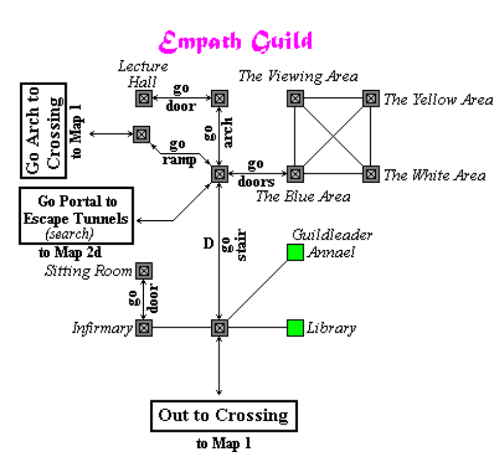

# Empath Guild - Comprehensive Reference v2

> Primary source of truth: `Empath.md` (database-backed DireLore audit from `raw_pages`, `sections`, `page_metadata`, `entities`, `canon_professions`, and `profession_skills`).
> Secondary supplemental source: external Empath reference text shared in Discord and attributed to Elanthipedia-style guild summaries.
> Conflict rule: when information differs, the DB-backed audit in `Empath.md` wins.

---

## 1. Scope and Source Priority

This document is a folded, reformatted version of the existing `Empath.md` research packet.

It does not replace the DB-backed audit with outside material. Instead, it:

- keeps the DireLore/DB audit as canonical
- reorganizes the material into clearer headings
- adds non-conflicting supplemental detail from the external Empath reference
- preserves the existing implementation guidance and microtask phases

Important scope note:

- The normalized profession tables are incomplete for Empath.
- `canon_professions` and `profession_skills` contain the profession shell.
- `profession_spells`, `profession_abilities`, and facts do not yet carry the full profession payload.
- The most reliable detailed source of truth currently lives in the raw scraped page corpus stored in the database.

---

## 2. Guild Identity

### Verified Profession Identity

- `canon_professions` identifies Empath as profession id `15` with source entity id `753`.
- Empaths are highly attuned to other living creatures.
- They heal by taking the hurts of others onto themselves.
- If they harm or kill living creatures, they risk temporary or permanent loss of healing ability.
- Empath is `Lore` primary, `Magic` and `Survival` secondary, `Weapon` and `Armor` tertiary.
- Empaths use `Life` mana.
- The profession page lists the special abilities as `Heal`, `Shift`, `Link`, and `Manipulate`.

### Mechanical Identity

The core class identity is not target-first direct healing. It is diagnosis, transfer, and self-risk.

- Healing begins with `TOUCH` to establish a diagnostic link.
- The Empath then `TAKE`s wounds, vitality loss, poison, disease, scars, and in some cases shock.
- The Empath must then recover those hurts on their own body through healing spells and related tools.

If Dragonsire wants the DragonRealms feel, this transfer loop is the part that must survive translation.

### Supplemental External Identity Notes

These details came from the external Empath reference and do not directly conflict with the DB audit:

- Guild crest: an open hand reaching out to provide comfort, often with healing herbs in the palm.
- Guild color: sapphire blue.
- Mana type: Life.
- Broad player fantasy: healer first, but with a real Battle Empath path built around survival, defensive play, and selective control rather than normal weapon aggression.

### Crafting and Lore-Prime Affinity

The external reference also notes lore-prime crafting affinity and Remedies/Cooking technique advantages. This is useful flavor for future profession identity, but it is not currently established as implementation-critical in the DB audit.

Confidence:

- High confidence: profession identity, skillset weights, mana type, class restriction on harming living creatures.
- Partial confidence: crest/color/crafting details unless revalidated from the DB corpus later.

---

## 3. Guild Structure and Locations

### DB-Backed Guild Structure

The profession page and guildhall pages identify five guildhall locations:

- Crossing, led by Salvur Siksa
- Riverhaven, led by Nebela Mentrade
- Shard, led by K'miriel Lystrandoniel
- Aesry
- Hibarnhvidar

The profession page also states that the leadership of the Empaths' Guild is collectively known as the `Khalaen`.

### Crossing Guildhall Model

The Crossing guildhall page is especially useful as an implementation model. It includes:

- a courtyard garden
- guildleader's office
- library
- infirmary
- empath-only sitting room
- entrance into the Healerie / triage complex
- combat wing for defensive and healing training
- lecture hall and viewing area
- multiple color-coded treatment areas

This matters because the guild is not just a trainer room. In source material, it is a medical, social, instructional, and triage institution.

### Supplemental External Leadership Notes

The external reference adds additional location/leadership detail:

- Crossing: Salvur Siksa
- Riverhaven: Nebela Mentrade
- Shard: K'miriel Lystrandoniel
- Ratha / Aesry: Alris Burdlefoot
- Hibarnhvidar: Dagreth Rendarak

Because the DB audit only explicitly verified the five guildhall locations listed above, these extra assignments should be treated as supplemental until rechecked in DireLore raw pages.

Confidence:

- High confidence: Crossing, Riverhaven, Shard, Aesry, Hibarnhvidar, and the Khalaen label.
- Partial confidence: exact leader mappings for all halls beyond the explicitly verified DB entries.

---

## 4. Joining Experience and Early Onboarding

### What the DB Actually Supports

I did not find a dedicated modern formal initiation ritual page in the database comparable to a complete scripted induction walkthrough.

What the DB does support:

- The current guide to being an Empath says that when you first join the guild, you are given a lesson on how to heal and are taught `Heal Wounds`.
- That guide describes the starter loop as `TOUCH` patient, `TAKE` wound, then heal the wound on yourself.
- An older obsolete guide says that if you spoke to a guildleader, you had already begun, and in that older era names Annael in Crossing as the likely novice contact.

### Strongest Source-Backed Conclusion

- The profession experience begins with guildleader onboarding, not a preserved dramatic rite page.
- The initiation content is practical medical training: first link, first transfer, first self-heal.
- The class fantasy is taught through procedure, not ceremony.

### Supplemental External Join Framing

The external reference summarizes the join path more loosely:

- use `DIR EMPATH` to locate the guild
- speak with a guild NPC
- demonstrate attunement to life and pain

That matches the broad shape of the guild onboarding experience, but the DB-backed packet should still be treated as canonical because it is more concrete about the training-first start.

Confidence:

- Medium confidence: broad join flow and first-heal onboarding.
- Low confidence: any claim of a single preserved modern initiation ritual beyond guildleader onboarding and first-healing instruction.

---

## 5. Core Healing Loop

The raw profession and healing pages are consistent on the central loop:

1. `TOUCH` the patient to establish a diagnostic link.
2. Assess wounds, vitality, poison, disease, and related burdens.
3. `TAKE` those burdens into the Empath's own body.
4. Recover on the Empath side using self-healing spells and support tools.

This is the class.

### Why It Matters

- Empath is not built around fire-and-forget ally healing.
- Empath is not built around safe throughput optimization.
- Empath is built around triage judgment, transfer risk, and self-management.

### Practical Triage Rules from the Healing Page

- Do not transfer poison, disease, or scars until the Empath can handle them on self.
- Vitality transfer is possible, but apparent patient vitality loss can be far more dangerous to the healer than it looks.
- Multiple Empaths can distribute shock in a shock circle.
- Over-healing is a real failure state: the healer can die by taking lethal wounds, bleeding, scars, or other burden.
- The healing page explicitly discusses infirmary healing, field healing, triage behavior, and etiquette such as asking before healing and taking turns.

This is the strongest evidence that the Empath player experience is about managing damage flow rather than simply restoring health bars.

Confidence:

- High confidence.

---

## 6. Core Guild Abilities

### Touch

- `TOUCH` creates the diagnostic link.
- It reveals wounds, vitality, poison, and disease.
- It is the gateway ability for later systems such as `Shift` and `Link`.

Supplemental external phrasing aligns with this: `TOUCH <person>` establishes an empathic diagnostic connection and enables precise diagnosis.

### Take / Transfer

- `TAKE` is the core healing action.
- It supports wounds, scars, vitality, poison, disease, and empathic shock.
- The healing page documents optional syntax for partial transfer and speed control.
- Low skill causes slower transfers and more fragile links.

The external reference describes `TAKE <body part> FROM <person>` and `TAKE ALL FROM <person>` as signature commands. That command-level framing is useful for future command-surface design, but the DB-backed mechanic remains the important part: transfer onto self, then self-manage.

### Wound Reduction and Wound Redirection

- Highly skilled Empaths can automatically reduce the severity of wounds they transfer.
- Wound redirection is described as an advanced form of taking that changes the destination of transferred wounds.

### Perceive Health

- Empath-only sensing ability.
- Trains Empathy and Attunement.
- Detects life essences, poison, disease, low vitality, and whether something is living, undead, or a construct.
- Range appears to improve with combined Empathy and Attunement.
- Hidden or invisible beings can still be sensed if they are in range, though not always identified.
- There is a `20` second cooldown.

The external reference is consistent here and adds a useful warning: overload can produce self-harm effects when used in crowded areas. That is a strong candidate for later flavor or tuning, but not a contradiction.

### Link

- Requires an existing diagnostic link.
- Lets the Empath temporarily borrow part of another character's knowledge in a chosen skill.
- Costs fatigue and concentration to maintain.
- Multiple outgoing links are possible for the initiating Empath, but a target can only be under one such link.
- Both parties must remain in the same room.

### Persistent Link

- Requirement listed as `300 Empathy`.
- Converts a normal diagnostic link into one that persists while the Empath and patient remain in the same room.
- Enables `PERCEIVE HEALTH <patient>` without touching them again.
- Explicitly required for some other link-based abilities.

### Unity Link

- Requirement listed as `380 Empathy` and `70th circle`.
- Requires knowledge of basic Link.
- Intended for triage situations.
- Instantly transfers the patient's wounds to the Empath.
- Has a skill-based cooldown that starts around three minutes and can be reduced.
- Can instantly kill the Empath if used carelessly on lethal wounds.

### Hand of Hodierna

- Requirement listed as `440 Empathy` and `80th circle`.
- Requires a Persistent Link first.
- Provides a slow pulsing healing mode that gradually draws hurts from multiple patients.
- Starts at two supported links and can expand to four with skill.

### Manipulate

- Nonviolent creature control tool.
- `MANIPULATE FRIENDSHIP <creature>` can make many critters regard the Empath as friend or non-threat.
- Success can remove the creature from combat, make it leave, or make it focus elsewhere.
- Evil or undead creatures can instead become enraged and focus the Empath.
- Shock reduces effectiveness, and at full shock manipulation fails entirely.

The external reference's “Battle Empath” framing fits this well: manipulate is a survival/control tool, not a domination fantasy.

### Shift

- Appearance-altering ability for other characters.
- Available after `30th circle` by quest.
- Relies heavily on Empathy, with Scholarship and Appraisal also contributing.
- Requires a diagnostic link and target acceptance in normal play.
- Official guild stance in source material is that shifting is dangerous and forbidden.
- The page states that shifting became illegal as of `34 Shorka 406` and can trigger justice consequences in justice zones.

Confidence:

- High confidence: Touch, Take, Perceive Health, Link, Persistent Link, Unity Link, Hand of Hodierna, Manipulate, Shift.

---

## 7. Shock System

Shock is not side flavor. It is one of the profession's central systems.

### Verified Shock Behavior

- Shock is caused primarily by directly harming living beings.
- The shock page also lists fishing and healing a Necromancer with sufficient Divine Outrage as shock-causing examples.
- Shock is granular rather than binary.
- Shock causes a brief stun when incurred.
- As shock rises, empathy-based abilities weaken and effective Empathy may be penalized.

### Abilities Lost at Complete Insensitivity

- healing others
- link
- perceive health
- manipulate
- shift
- teaching or listening to Empathy classes
- Fountain of Creation
- Guardian Spirit
- Heart Link
- Regenerate
- Circle of Sympathy
- Embrace of the Vela'Tohr

### Abilities Reduced but Still Functional While Shocked

- Heal Wounds
- Heal Scars
- Vitality Healing
- Flush Poisons
- Cure Disease

### Abilities Listed as Unaffected at Full Shock

- Aesandry Darlaeth
- Aggressive Stance
- Awaken
- Blood Staunching
- Compel
- Gift of Life
- Innocence
- Iron Constitution
- Lethargy
- Mental Focus
- Nissa's Binding
- Paralysis
- Perseverance of Peri'el
- Refresh
- Tranquility
- Vigor

### Shock Sharing and Recovery

- At `10th circle`, other Empaths can `TAKE` part of a guildmate's shock.
- Each share takes about half the remaining shock, making shock circles efficient.
- The shock quest exists as a repeatable recovery path.
- The walkthrough says null / fully shocked Empaths must complete it before natural recovery resumes, and partially shocked Empaths can also run it to reduce current shock.
- The quest begins with Nadigo in Vela'Tohr Edge, Secluded Grove.

### External Reference Comparison

The outside reference correctly identifies shock as the profession's core tension, but it frames shock as something accumulated mainly through taking wounds from patients. The DB-backed audit is more precise and should win if the two readings diverge: shock is centrally tied to harming living beings and related canon edge cases, while healing burden is the broader risk loop around fatigue, wounds, and over-extension.

Confidence:

- High confidence.

---

## 8. Healing Workflow and Triage Rules

The Empath healing page is one of the highest-value source pages in the database because it describes the actual practical player loop.

- Healing starts with `TOUCH`.
- The Empath then `TAKE`s specific injuries.
- Poison, disease, and scars should not be transferred until the healer can manage them personally.
- Vitality transfer is possible but can be much more dangerous than it first appears.
- Multiple Empaths can cooperate through shock circles.
- Overextension can kill the healer.
- Triage behavior and healing etiquette are part of the lived class experience.

### Class Identity Reading

- Warrior manages pressure.
- Ranger manages positioning.
- Thief manages opportunity.
- Empath manages suffering.

That identity line comes from the existing microtask packet and still fits the DB evidence cleanly.

Confidence:

- High confidence.

---

## 9. Empathy Skill and Progression Identity

The Empathy skill page confirms that Empathy is exclusive to the Empath guild.

### Verified Training Methods

- Best training source is healing patients.
- Healing another Empath does not teach Empathy.
- Manipulating creatures teaches a meaningful amount when challenge exists.
- `Icutu Zaharenela` can teach Empathy in battle, especially for shocked Empaths.
- `Perceive Health` teaches Empathy if a living being is successfully perceived.

### Supplemental External Training Notes

The outside reference adds several plausible, non-conflicting training details:

- `Perceive Health` is lower throughput but independent of patient availability.
- `Shift` can provide experience pulses over its cooldown.
- active `Link` provides a small passive pulse
- teaching/listening, anatomy chart study, and parasite removal all matter as side training methods

These should be treated as useful supplemental training notes rather than replacements for the DB-backed core list.

Confidence:

- High confidence: healing, manipulate, IZ, perceive health as training pillars.
- Partial confidence: some of the smaller external training method details until revalidated from raw pages.

---

## 10. Circle Requirements and Skill Structure

### Verified Requirement Structure

The profession page and Empath 3.0 page agree on the circle structure.

- Hard requirements are `Empathy`, `First Aid`, and `Scholarship`.
- `Outdoorsmanship` is a soft requirement.
- `Sorcery` and `Thievery` are restricted skills on the Empath 3.0 page.

The profession page provides a full per-band circle requirement table and cumulative totals through `200` circles.

The most important class-defining detail is that `Empathy`, `First Aid`, and `Scholarship` are hard gates. That reinforces the profession as healer-scholar first.

### Supplemental External Skill Categorization

The external reference gives a useful implementation-oriented skill reading:

- Lore focus: Empathy, Scholarship, Tactics, Appraisal, Alchemy/Remedies
- Magic focus: Attunement, Augmentation, Warding, Targeted Magic, Arcana
- Survival focus: First Aid, Outdoorsmanship, Evasion, Athletics, Perception
- Weapon/Armor focus: light defensive survivability rather than aggressive weapon mastery

That categorization aligns with the DB-backed identity and is useful for presentation, even where it is more advisory than canonical.

Confidence:

- High confidence: hard requirements, soft requirement, overall circle structure.
- Partial confidence: recommended loadouts and preferred tertiary builds.

---

## 11. Spellbooks and Spell Roster

The profession page names five spellbooks:

- Healing
- Protection
- Body Purification
- Mental Preparation
- Life Force Manipulation

### Healing Spellbook

- Heal Wounds
- Heal Scars
- Vitality Healing
- Heal
- Fountain of Creation
- Regenerate

### Protection Spellbook

- Aggressive Stance
- Innocence
- Iron Constitution
- Aesandry Darlaeth
- Guardian Spirit
- Perseverance of Peri'el

### Body Purification Spellbook

- Blood Staunching
- Cure Disease
- Flush Poisons
- Heart Link
- Absolution
- Adaptive Curing

### Mental Preparation Spellbook

- Mental Focus
- Awaken
- Compel
- Tranquility
- Circle of Sympathy
- Calculated Rage
- Embrace of the Vela'Tohr
- Nissa's Binding

### Life Force Manipulation Spellbook

- Refresh
- Gift of Life
- Lethargy
- Paralysis
- Raise Power
- Vigor
- Icutu Zaharenela

### Spell Tags that Matter for Implementation

- Signature spells exist.
- Cyclic spells include `Aesandry Darlaeth`, `Guardian Spirit`, `Regenerate`, and `Icutu Zaharenela`.
- Ritual spells include `Absolution`, `Circle of Sympathy`, `Embrace of the Vela'Tohr`, and `Perseverance of Peri'el`.
- Illegal spells include `Nissa's Binding` and `Icutu Zaharenela`.
- `Adaptive Curing` and `Icutu Zaharenela` are marked `Scroll-only` in the captured metadata.

### Supplemental External Spellbook Framing

The outside reference uses slightly more thematic spellbook labels and also calls out notable spells such as `Heal Wounds`, `Awaken`, `Osrel Meraud`, `Aura of Deflection`, `Icutu Zaharenela`, `Empathy Feedback`, `Absolution`, and `Gift of Life`.

Those are useful names to keep in a human-readable overview, but the DB-backed spellbook membership and roster above remain the authoritative structure for implementation planning.

Confidence:

- High confidence.

---

## 12. Lore, Tone, and First Empaths

### DB-Backed Lore Usefulness

The `First Empaths` page provides the clearest mythic background preserved in the DB corpus.

- The first group who developed supernatural empathy became too sensitive to live normally among others.
- One of them was chosen and cast out so the knowledge could be reduced, hidden, or channeled in later generations.
- Modern Empathy is framed as something deliberately channeled and lessened so later Empaths could survive it.

That is directly useful for tone. The guild is not just compassionate. It is built on the danger of feeling too much.

### Supplemental External Lore Notes

The outside reference contributes additional historical framing:

- Empathy was once referred to as `Transference`.
- The skill allegedly began as a decaying skill that lost ranks when unused.
- The killing prohibition is presented as a defining guild identity feature.
- `Shift` is described as controversial and socially forbidden beyond its legal layer.

These notes fit the existing tone but should be treated as supplemental until each claim is individually rechecked in the DB corpus.

Confidence:

- High confidence: First Empaths tone and danger-of-sensitivity framing.
- Partial confidence: some of the broader history/mechanics-history notes from the outside summary.

---

## 13. What This Means for Recreating the Player Experience

The source-backed Dragonsire takeaways are:

- Empath should be built around link-first interaction, not passive direct ally heals.
- Damage transfer and self-risk are the class identity.
- Shock must meaningfully interfere with core empathic actions.
- `Perceive Health` should make Empath a sensor and triage class, not just a healer.
- `Manipulate` provides a nonviolent survival and control path.
- Advanced links are major class progression milestones.
- The guildhall should feel like a healer school and triage institution, not just a rank-up kiosk.

The supplemental external reference reinforces one useful player-experience split:

- Healer path: diagnose, transfer, self-heal, survive the burden.
- Battle Empath path: survive, avoid or redirect violence, use empathic and magical tools instead of normal killing loops.

That split is compatible with the DB-backed class identity as long as the killing restriction and shock consequences remain real.

---

## 14. Recommended Implementation Order from the DB Evidence

This section is preserved directly from the existing packet because it reflects the DB audit most cleanly.

1. `TOUCH` and detailed diagnostic link.
2. `TAKE` / transfer for wounds, vitality, poison, disease, and shock.
3. Self-healing loop with over-heal risk.
4. Shock accumulation, penalties, sharing, and recovery path.
5. `PERCEIVE HEALTH`.
6. `LINK`, then `Persistent Link`.
7. `Unity Link` and `Hand of Hodierna` for group triage.
8. `Manipulate`.
9. `Shift` as a later social / justice-layer system.

---

## 15. Database Confidence Notes

- High confidence: profession identity, skillsets, mana type, guildhall locations, guild abilities, healing loop, shock behavior, perceive health behavior, link behavior, manipulate behavior, shift legality, spellbook membership, spell roster, circle requirement structure.
- Medium confidence: exact modern onboarding script, because the DB contains guides and books rather than a dedicated live join script page.
- Low confidence: any claim that there is a single formal modern guild-joining ritual beyond guildleader onboarding and first-healing instruction.

---

## 16. Comparison Notes Against the External Empath Reference

This section explicitly records where the external reference lined up well and where the DB-backed packet should remain authoritative.

### Strong Alignment

- Empath is a transfer healer, not a direct-heal caster class.
- Shock is central to the profession.
- `Touch`, `Take`, `Perceive Health`, `Link`, `Manipulate`, and `Shift` are core identity verbs.
- There is a meaningful Battle Empath path.
- Advanced link systems are progression milestones, not side flavor.

### Useful Supplemental Detail Folded In

- crest/color/guild-presentation notes
- additional guild leader names and site flavor
- broader player-style framing
- convenient human-readable spell and skill summaries
- some extra training-method notes

### Where the DB Audit Must Win

- Any formal join ritual claims not directly supported in DireLore raw pages
- Any leader/location mapping not explicitly verified in the DB audit
- Any shock explanation that drifts away from the canon harm-to-living-beings rule set
- Any command syntax or mechanic statement that conflicts with raw page evidence

---

## Appendix A - Existing Microtask Packet Preserved

The material below is retained from the original `Empath.md` so the merged file still contains the implementation planning that grew out of the audit.

### EMPATH TRAINING (001–030)

Phase: learning-path unification, pool-first progression, and DR-backed Empath training hooks.

- EMPATH 001 - Confirm the authoritative progression path
- EMPATH 002 - Ensure empathy, first_aid, scholarship exist in transient EXP skills
- EMPATH 003 - Seed missing EXP skill state on character init/repair
- EMPATH 004 - Enforce rank-cost rule in the real EXP path
- EMPATH 005 - Make pools authoritative, not direct rank gain
- EMPATH 006 - Add or verify mindstate update from pool
- EMPATH 007 - Remove legacy use_skill from empath TAKE paths
- EMPATH 008 - Add a real empathy XP calculator helper
- EMPATH 009 - Make empathy XP difficulty-based, not flat
- EMPATH 010 - Add transfer-type modifiers to empathy XP
- EMPATH 011 - Add non-empath patient bonus / empath patient penalty
- EMPATH 012 - Add QUICK transfer bonus to empathy XP
- EMPATH 013 - Hook ordinary TAKE to empathy XP helper
- EMPATH 014 - Hook vitality transfer to empathy XP helper
- EMPATH 015 - Hook poison and disease transfer to empathy XP helper
- EMPATH 016 - Hook Manipulate to empathy XP
- EMPATH 017 - Hook Perceive Health to low-yield empathy XP
- EMPATH 018 - Hook Link to tiny empathy trickle
- EMPATH 019 - Hook Unity and Channel/HoH-style systems to higher empathy yield
- EMPATH 020 - Remove legacy use_skill from perceive/manipulate/link/channel paths
- EMPATH 021 - Hook TEND to First Aid using the authoritative EXP system
- EMPATH 022 - Implement 15-second First Aid training pulses for 5 minutes
- EMPATH 023 - Prevent First Aid spam abuse
- EMPATH 024 - Scale First Aid XP by bleed/wound severity
- EMPATH 025 - Hook anatomy study to Scholarship and First Aid
- EMPATH 026 - Add optional tiny empathy gain from anatomy study
- EMPATH 027 - Verify skillset-based pool formulas are applied to these three skills
- EMPATH 028 - Align pulse groups for empathy and first_aid
- EMPATH 029 - Make pulse the only source of rank gain
- EMPATH 030 - Add focused regression checks for learning unification

The earlier `001–040` packet is superseded wherever it conflicts with the DireLore-backed learning rewrite in `Empath.md`.

### EMPATH MICRO TASKS (041–060)

Phase: Poison, Disease, Shock Enforcement

- EMPATH 041 - Add Poison System
- EMPATH 042 - Add Disease System
- EMPATH 043 - Poison Behavior
- EMPATH 044 - Disease Behavior
- EMPATH 045 - Diagnose Output Update
- EMPATH 046 - Assess Precision Update
- EMPATH 047 - Transfer Poison
- EMPATH 048 - Transfer Disease
- EMPATH 049 - Poison Transfer Risk
- EMPATH 050 - Disease Transfer Risk
- EMPATH 051 - Add Purge Command
- EMPATH 052 - Purge Effect
- EMPATH 053 - Purge Messaging
- EMPATH 054 - Shock Gain Hook
- EMPATH 055 - Shock Threshold Effects
- EMPATH 056 - Shock Messaging
- EMPATH 057 - Shock Impacts Transfer
- EMPATH 058 - Shock Impacts Perception
- EMPATH 059 - Add Shock Decay System
- EMPATH 060 - Poison/Disease/Shock Test Scenario

### EMPATH MICRO TASKS (061–080)

Phase: Link System + Group Support + Control

The original packet proposed a broader multi-link refactor. The implementation that followed intentionally collapsed to a constrained structured-link authority before higher-order mechanics were added. Keep the later implementation notes as the operative source over the older “multiple outgoing links first” plan if they diverge.

- EMPATH 061 - Link System Refactor
- EMPATH 062 - Link Types Enum
- EMPATH 063 - Link Strength System
- EMPATH 064 - Add Command: Link
- EMPATH 065 - Link vs Touch Difference
- EMPATH 066 - Link Duration System
- EMPATH 067 - Link Messaging
- EMPATH 068 - Transfer Scaling with Link Strength
- EMPATH 069 - Add Persistent Link
- EMPATH 070 - Persistent Link Effect
- EMPATH 071 - Persistent Link Drain
- EMPATH 072 - Add Command: Unity
- EMPATH 073 - Unity Effect
- EMPATH 074 - Unity Logic
- EMPATH 075 - Unity Limitations
- EMPATH 076 - Unity Messaging
- EMPATH 077 - Add Command: Manipulate
- EMPATH 078 - Manipulate Effect
- EMPATH 079 - Manipulate Behavior Rules
- EMPATH 080 - Full Link + Group Test

### EMPATH MICRO TASKS (081–100)

Phase: Advanced Link + Redirection + System Completion

The original packet's final phase is preserved for historical continuity, but the implemented 081–100 pass should be read through the stricter “burden, not buff” design lens now established in code.

- EMPATH 081 - Link Priority System
- EMPATH 082 - Selective Transfer Targeting
- EMPATH 083 - Multi-Link Awareness Display
- EMPATH 084 - Add Redirect Command
- EMPATH 085 - Redirect Logic
- EMPATH 086 - Redirect Risk
- EMPATH 087 - Redirect Messaging
- EMPATH 088 - Add Wound Smoothing Effect
- EMPATH 089 - Smoothing Limitations
- EMPATH 090 - Add Deep Link Enhancement
- EMPATH 091 - Deep Link Messaging
- EMPATH 092 - Add Overdraw Mechanic
- EMPATH 093 - Overdraw Messaging
- EMPATH 094 - Add Recovery Loop: Center
- EMPATH 095 - Center Messaging
- EMPATH 096 - Link Decay Over Time
- EMPATH 097 - Link Break Feedback
- EMPATH 098 - Identity Feedback System
- EMPATH 099 - Full System Validation
- EMPATH 100 - Balance + Config Hooks

---

## Appendix B - Implementation Design Locks That Still Matter

Preserved from the original packet and reinforced by the later implementation passes:

- Do not add direct “heal target” abilities that bypass transfer.
- Do not trivialize shock.
- Do not make purge too strong.
- Do not let group systems remove the burden-management identity.
- Empath should feel like damage-flow management, not safe throughput optimization.

---

## Appendix C - Summary for Future Profession Work

If this document is used as the handoff packet for future Empath work, the priority should remain:

1. Keep DB-backed class identity authoritative.
2. Treat external wiki-style summaries as augmentation, not replacement.
3. Preserve link-first healing and self-risk as the immovable core.
4. Treat shock as a real behavioral limiter, not just a number on the sheet.
5. Let advanced links and group tools increase burden management complexity rather than erase it.

---

## Appendix D - Empath Service Economy Lock

This phase captures a DragonRealms-authentic rule that should not be lost during implementation:

- player Empaths are socially driven, not hard-priced vendors
- payment is not required for player healing
- tipping exists as a social signal and priority hint, not as an automatic gate
- Empaths must retain agency over who they help first
- an NPC healer exists as fallback so players are never fully blocked
- the NPC healer must be slower, more clinical, and economically predictable

In one sentence:

- player Empaths are charity-and-relationship driven
- NPC healers are fee-for-service safety nets

This means Dragonsire should avoid three failures:

- do not make healing mandatory paid
- do not make the NPC healer cheap and superior
- do not auto-enforce highest-tipper-first triage

---

## Appendix E - Empath Micro Tasks (131-150)

Phase: Charity Economy + Triage Priority + NPC Fallback

Phase note:

- These tasks modify and extend Perceive Health from EMPATH 029-034.
- Do not reimplement base Perceive Health functionality here.

Note: this tranche intentionally skips ahead from the earlier packet. Tasks 029-034 already introduced the first Perceive Health implementation, so 131-137 are delta and world-integration tasks rather than duplicate core work.

- EMPATH 131 - Enforce Perceive Health Cooldown
- EMPATH 132 - Add Perceive Target Mode Polish
- EMPATH 133 - Add Roomwide Triage Scan Output
- EMPATH 134 - Convert Perceive Output to Soft Severity Labels
- EMPATH 135 - Add Hidden Suffering Detection Messaging
- EMPATH 136 - Add Perceive Overload Warning in Crowded Rooms
- EMPATH 137 - Hook Perceive Results into Empath Triage Context
- EMPATH 138 - Create NPC House Healer
- EMPATH 139 - Add Command: Request Healing
- EMPATH 140 - Add NPC Per-Wound Cost Calculation
- EMPATH 141 - Implement NPC Healing Resolution
- EMPATH 142 - Add NPC Healer Limitations and Tone
- EMPATH 143 - Add Command: Tip
- EMPATH 144 - Store Last Tip, Recent Tip, and Lifetime Tips
- EMPATH 145 - Add Tip Messaging Without Numeric Leakage
- EMPATH 146 - Define Recent Tip Decay Window
- EMPATH 147 - Add Empath-Only Queue Command
- EMPATH 148 - Add Soft Queue Sorting Heuristics
- EMPATH 149 - Add Queue Output with Social Memory Labels
- EMPATH 150 - Add Empath Reputation Memory Hook

### EMPATH MICRO TASKS (151-180)

Phase: Combat Integration + Pressure Scenarios

- EMPATH 151 - Hook Combat Damage into Wound System
- EMPATH 152 - Split Vitality from Wound Burden
- EMPATH 153 - Make Wounds Persist Until Treated
- EMPATH 154 - Add Untreated Wound Penalties
- EMPATH 155 - Add Bleeding Tick
- EMPATH 156 - Disable Passive Full Recovery
- EMPATH 157 - Add Command: Rest
- EMPATH 158 - Add Injury-State Messaging
- EMPATH 159 - Add Soft Combat Lock Threshold
- EMPATH 160 - Add Death Risk from Overextension
- EMPATH 161 - Support Multi-Patient Triage Scenes
- EMPATH 162 - Add Triage Highlight Messaging
- EMPATH 163 - Add Critical Condition State
- EMPATH 164 - Add Patient Degradation Over Time
- EMPATH 165 - Add Panic Messaging for Critical Patients
- EMPATH 166 - Increase Transfer Risk Under Load
- EMPATH 167 - Add Dangerous-Transfer Warnings
- EMPATH 168 - Add Overload Event
- EMPATH 169 - Add Recovery Delay After Overload
- EMPATH 170 - Add Visible Empath Degradation
- EMPATH 171 - Hook Shock into Combat Aggression
- EMPATH 172 - Add Shock Feedback Messaging
- EMPATH 173 - Reduce Empath Effectiveness Under Shock
- EMPATH 174 - Block Advanced Abilities at High Shock
- EMPATH 175 - Add Basic Shock Recovery Path
- EMPATH 176 - Create Injured NPC Generator
- EMPATH 177 - Add NPC Help Requests
- EMPATH 178 - Add Reward for NPC Healing
- EMPATH 179 - Add Multi-Injury Event Scenario
- EMPATH 180 - Add DireTest: Triage Pressure

### EMPATH MICRO TASKS (181-210)

Phase: Healing Spells + Purification Core

- EMPATH 181 - Create Empath Healing Module
- EMPATH 182 - Add Command: Heal Wounds
- EMPATH 183 - Implement Heal Wounds Severity Reduction
- EMPATH 184 - Scale Healing Efficiency by Burden
- EMPATH 185 - Add Healing Cost System
- EMPATH 186 - Add Healing Failure Condition
- EMPATH 187 - Add Heal Wounds Messaging
- EMPATH 188 - Add Command: Heal Vitality
- EMPATH 189 - Implement Vitality Healing Effect
- EMPATH 190 - Enforce Vitality Cap
- EMPATH 191 - Add Vitality Healing Tradeoff
- EMPATH 192 - Add Vitality Healing Messaging
- EMPATH 193 - Add Bleeding Flag to Wound Model
- EMPATH 194 - Add Command: Staunch
- EMPATH 195 - Add Staunch Validation
- EMPATH 196 - Scale Bleeding Control by Severity
- EMPATH 197 - Add Poison State
- EMPATH 198 - Add Poison Tick System
- EMPATH 199 - Add Command: Purge Poison
- EMPATH 200 - Add Purge Risk Under Strain
- EMPATH 201 - Integrate Poison Transfer with TAKE
- EMPATH 202 - Add Poison Warning Messaging
- EMPATH 203 - Add Disease State
- EMPATH 204 - Add Disease Effects
- EMPATH 205 - Add Command: Cure Disease
- EMPATH 206 - Scale Cure Difficulty by Disease Severity
- EMPATH 207 - Integrate Disease Transfer with TAKE
- EMPATH 208 - Add Healing vs Burden Interaction
- EMPATH 209 - Add Recovery Feedback Messaging
- EMPATH 210 - Add DireTest: Empath Healing Core

### Responsibility Boundaries

- `TAKE` moves damage and conditions.
- `heal wounds` reduces wound severity only.
- `heal vitality` restores survivability only.
- `staunch` stops bleeding only.
- `purge poison` and `cure disease` handle toxin states only.

Do not let these commands overlap responsibility or players will route around the burden model.

### EMPATH MICRO TASKS (211-240)

Phase: Control + Advanced Perception + Cooperation

- EMPATH 211 - Add Command: Manipulate
- EMPATH 212 - Add Manipulate Validation
- EMPATH 213 - Implement Manipulate Core Effect
- EMPATH 214 - Add Manipulate vs Creature-Type Rules
- EMPATH 215 - Add Manipulate Cost
- EMPATH 216 - Add Manipulate Failure Outcome
- EMPATH 217 - Add Manipulate Messaging
- EMPATH 218 - Add Manipulate Cooldown System
- EMPATH 219 - Add Perceive Range Scaling
- EMPATH 220 - Add Perceive Accuracy Scaling
- EMPATH 221 - Add Deep Scan Mode
- EMPATH 222 - Add Deep Scan Risk
- EMPATH 223 - Add Emotional-State Detection
- EMPATH 224 - Add Perceive Interference
- EMPATH 225 - Add Perceive Failure Case
- EMPATH 226 - Add Shock Sharing Command
- EMPATH 227 - Implement Shock Sharing Effect
- EMPATH 228 - Add Shock Sharing Limits
- EMPATH 229 - Add Shock Circle Behavior
- EMPATH 230 - Add Shock Circle Messaging
- EMPATH 231 - Add Cooperative Triage Bonus
- EMPATH 232 - Prevent Cooperation Exploit Loops
- EMPATH 233 - Add Multi-Target Awareness UI
- EMPATH 234 - Add Priority Conflict Scenario
- EMPATH 235 - Add Group Failure State
- EMPATH 236 - Add Cooperative Recovery Flow
- EMPATH 237 - Add Cognitive Load System
- EMPATH 238 - Add Decision Pressure Messaging
- EMPATH 239 - Add Collapse Cascade
- EMPATH 240 - Add DireTest: Empath Group Pressure

### EMPATH MICRO TASKS (241-270)

Phase: Resonant Channel + Mitigation + Passive Sensing

- EMPATH 241 - Add Passive Sensitivity Hook
- EMPATH 242 - Add Passive Sensitivity Messaging
- EMPATH 243 - Add Sensitivity Range
- EMPATH 244 - Add Sensitivity Accuracy Scaling
- EMPATH 245 - Add Critical Signal Override
- EMPATH 246 - Add Mitigation Hook to TAKE
- EMPATH 247 - Add Mitigation Factor
- EMPATH 248 - Add Mitigation Rules
- EMPATH 249 - Add Mitigation Messaging
- EMPATH 250 - Add Mitigation Penalty Under Strain
- EMPATH 251 - Add Over-Mitigation Risk
- EMPATH 252 - Add Command: Channel
- EMPATH 253 - Add Channel Requirements
- EMPATH 254 - Add Channel Activation State
- EMPATH 255 - Add Channel Tick Effect
- EMPATH 256 - Add Channel Throughput Rules
- EMPATH 257 - Add Channel Strain Scaling
- EMPATH 258 - Add Channel Capacity Scaling
- EMPATH 259 - Add Channel Break Conditions
- EMPATH 260 - Add Channel Messaging
- EMPATH 261 - Add Channel Overload
- EMPATH 262 - Add Channel Collapse Effect
- EMPATH 263 - Add Channel Warning Messaging
- EMPATH 264 - Add Channel Efficiency Drop
- EMPATH 265 - Add Channel vs Mitigation Interaction
- EMPATH 266 - Add Passive Sensitivity to Channel Hinting
- EMPATH 267 - Add Channel + Queue Integration
- EMPATH 268 - Add Multi-Empath Channel Interaction
- EMPATH 269 - Prevent Channel Exploits
- EMPATH 270 - Add DireTest: Empath Channel System

### PHASE LOCK

Do not proceed to long-term systems such as scars, trauma, identity, reputation, or endgame progression until EMPATH 271-290 is complete.

This phase closes the core empath ability surface.

### EMPATH MICRO TASKS (271-290)

Phase: Core Ability Completion Pass

- EMPATH 271 - Add Command: Stabilize
- EMPATH 272 - Add Stabilize Effect
- EMPATH 273 - Add Stabilize Duration
- EMPATH 274 - Add Stabilize Validation
- EMPATH 275 - Add Stabilize Messaging
- EMPATH 276 - Add Stabilize Interaction Rules
- EMPATH 277 - Add Command: Take Vitality
- EMPATH 278 - Add Vitality Transfer Effect
- EMPATH 279 - Add Vitality Transfer Risk
- EMPATH 280 - Add Vitality Transfer Messaging
- EMPATH 281 - Extend TAKE Syntax for Selective Transfer
- EMPATH 282 - Add Body Part Mapping
- EMPATH 283 - Add Selective Validation
- EMPATH 284 - Add Selective Transfer Effect
- EMPATH 285 - Add Selective Messaging
- EMPATH 286 - Extend TAKE Syntax for Partial Transfer
- EMPATH 287 - Add Percentage Transfer Logic
- EMPATH 288 - Add Rate-Based Transfer
- EMPATH 289 - Add Partial Transfer Messaging
- EMPATH 290 - Add Residual Wound State

### CODE-FACING NOTES (271-290)

- Touch only: `commands/cmd_stabilize.py`, `commands/cmd_take.py`, `typeclasses/characters.py`, and shared wound helpers only if strictly necessary.
- `cmd_stabilize.py` already exists. Keep it thin and extend `Character.stabilize_empath_target` instead of creating a parallel stabilize path.
- Add `db.stabilized_until` through character creation/default repair paths, then let stabilize slow worsening and bleeding without healing or purging conditions.
- `cmd_take.py` should stay as parser + router. Extend parsing for selective targets and partial/rate modifiers, then forward into `take_empath_wound`.
- `take_empath_wound` remains the authoritative transfer pipeline. Reuse existing shock, link, unity, strain, and overload behavior.
- The current empath wound model is aggregate bucket based, not a wound-object list. Do not replace it for this phase.
- Selective take should map onto existing wound buckets and body-part bleed/internal state where available; fail cleanly when no valid subset exists.
- Vitality transfer should stay a specialized branch inside `take_empath_wound`, not a new command family or health subsystem.
- Residual is a data hook only. Add optional compatibility on existing detailed wound/body-part state without adding gameplay.